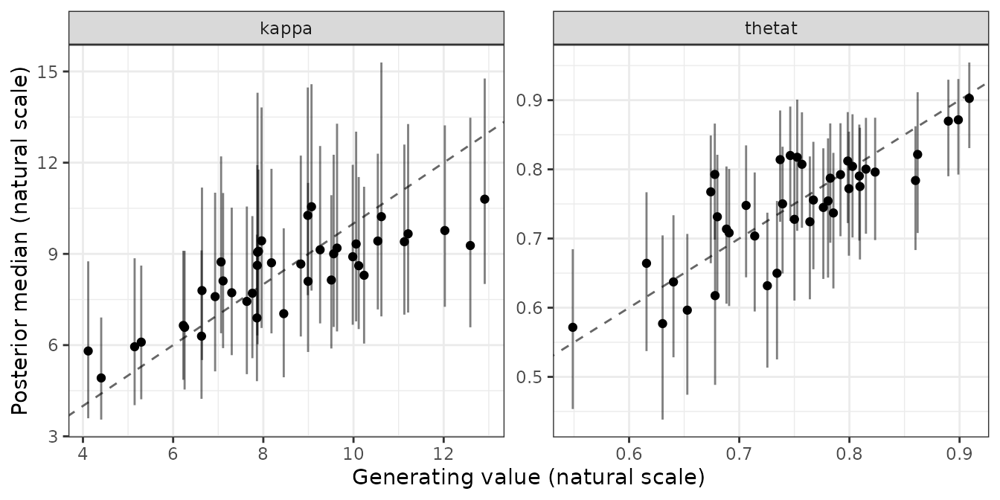
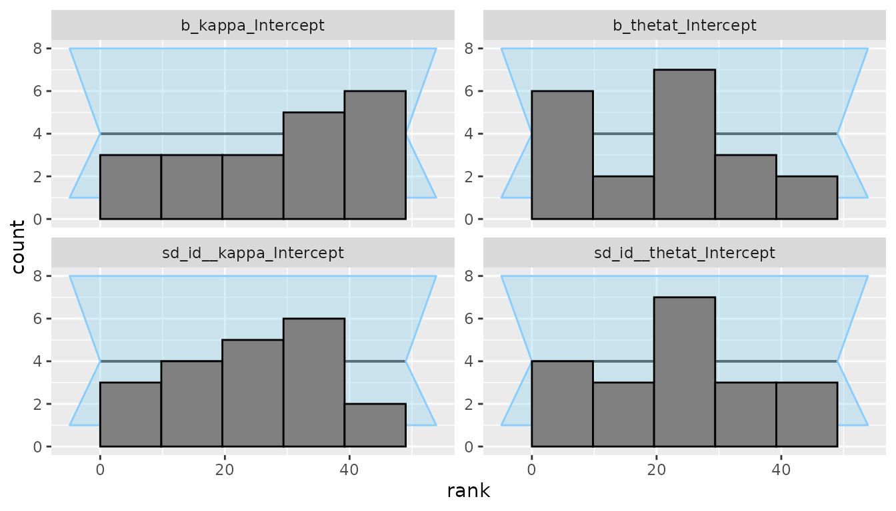
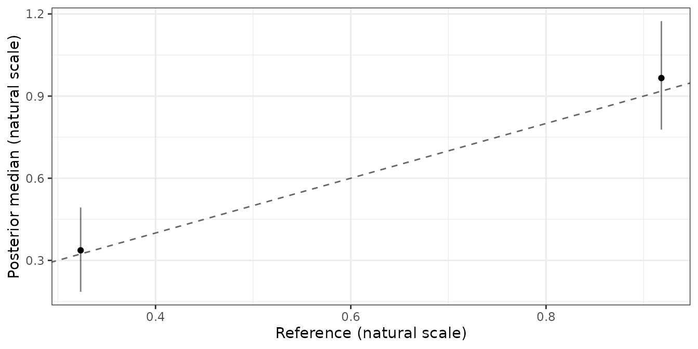

# Validating a new bmm model

This article walks once through the loop every bmmtools check is built
on: simulate data from known parameters, fit the model, score the fit
against the truth. It uses one model and one design, so that each step
is visible. [Running a recovery
study](https://www.gfrischkorn.org/bmmtools/articles/recovery-grid.md)
repeats the same loop over a design grid.

The second half asks the three other questions a new model has to
answer.
[`prior_check()`](https://www.gfrischkorn.org/bmmtools/reference/prior_check.md)
asks what the priors imply before any data are fitted,
[`sbc()`](https://www.gfrischkorn.org/bmmtools/reference/sbc.md) whether
the implementation is correct, and
[`cross_check()`](https://www.gfrischkorn.org/bmmtools/reference/cross_check.md)
whether the model agrees with what is already known. Only the scorer
changes; the loop is the same one.

The model is bmm’s two-parameter mixture model, `mixture2p`, because an
adapter for it ships with bmmtools. A model without one works the same
way once you supply a generator; see [Validating a model without a
built-in
adapter](https://www.gfrischkorn.org/bmmtools/articles/own-model.md).

To run the code you need bmm, brms and a working
[cmdstanr](https://mc-stan.org/cmdstanr/) installation. The output below
was computed once with that code and saved, so the page itself was built
without Stan.

## The model and the truth

``` r

library(bmmtools)

model <- bmm::mixture2p(resp_error = "y")
pars <- c(kappa = log(8), thetat = qlogis(0.75))
sds <- c(kappa = 0.3, thetat = 0.5)
```

`pars` are the population values that generate the data. They are given
**on the link scale** and under bmm’s own parameter names, because that
is the scale the model is estimated on: `kappa` has a log link and
`thetat` a logit link, so `log(8)` is a precision of 8 and
`qlogis(0.75)` a mixture weight of 0.75. `sds` are between-subject
standard deviations on the same scale. A parameter not named in `sds`
does not vary between subjects.

## Simulate

``` r

sim <- simulate_recovery(
  model,
  pars = pars, sds = sds,
  n_subjects = 40, n_trials = 100,
  seed = 1
)
sim$data
sim$truth$population
```

    #> # A tibble: 4,000 × 2
    #>    id          y
    #>    <fct>   <dbl>
    #>  1 1     -0.338 
    #>  2 1     -0.546 
    #>  3 1      0.819 
    #>  4 1     -0.683 
    #>  5 1     -1.30  
    #>  6 1      0.0210
    #>  7 1      2.37  
    #>  8 1      0.299 
    #>  9 1     -0.698 
    #> 10 1     -1.14  
    #> # ℹ 3,990 more rows
    #> # A tibble: 2 × 2
    #>   term   true_value
    #>   <chr>       <dbl>
    #> 1 kappa        2.08
    #> 2 thetat       1.10

[`simulate_recovery()`](https://www.gfrischkorn.org/bmmtools/reference/simulate_recovery.md)
draws one value per subject and parameter on the link scale, converts it
with
[`inverse_link()`](https://www.gfrischkorn.org/bmmtools/reference/inverse_link.md)
and hands it to the model’s own generator, here
[`bmm::rmixture2p()`](https://venpopov.com/bmm/reference/mixture2p_dist.html).
It returns the data and the truth: `truth$population` holds the values
in `pars`, and `truth$subjects` holds each subject’s drawn values, both
on the link scale. The seed makes the draw reproducible and is applied
only around it, so the global random number state is left alone.

## Fit once, reuse afterwards

``` r

fit <- fit_cached(
  recovery_formula(model), sim$data, model,
  file = file.path(fits_dir, "mixture2p-40x100"),
  seed = 1, chains = 4, iter = 2000, cores = 4, backend = "cmdstanr"
)
```

[`recovery_formula()`](https://www.gfrischkorn.org/bmmtools/reference/recovery_formula.md)
gives every free parameter of the model a random intercept over `id`,
the column
[`simulate_recovery()`](https://www.gfrischkorn.org/bmmtools/reference/simulate_recovery.md)
writes.
[`fit_cached()`](https://www.gfrischkorn.org/bmmtools/reference/fit_cached.md)
fits with [`bmm::bmm()`](https://venpopov.com/bmm/reference/bmm.html)
and saves the fit next to a key. Calling it again with the same
arguments reads the fit back instead of sampling:

``` r

fit <- fit_cached(
  recovery_formula(model), sim$data, model,
  file = file.path(fits_dir, "mixture2p-40x100"),
  seed = 1, chains = 4, iter = 2000, cores = 4, backend = "cmdstanr"
)
attr(fit, "bmmtools_cache")$reused
```

    #> [1] TRUE

The key covers the formula, data, model, prior, seed, chains,
iterations, warmup, thinning, `control`, `init`, the backend and the
installed versions of bmm, brms and the Stan toolchain. When one of them
changes, the model is refitted and the message names what changed.

## The convergence gate

``` r

check_convergence(fit)
```

    #> # A tibble: 1 × 8
    #>   max_rhat min_ess_bulk min_ess_tail n_divergent n_max_treedepth n_variables pass  failed
    #>      <dbl>        <dbl>        <dbl>       <int>           <int>       <int> <lgl> <chr> 
    #> 1     1.01         970.        1786.           0               0          86 TRUE  ""

[`check_convergence()`](https://www.gfrischkorn.org/bmmtools/reference/check_convergence.md)
returns the worst rhat, the smallest bulk and tail effective sample
sizes, the divergent transitions and the tree-depth hits over all
variables, and a verdict under thresholds that are arguments: rhat at
most 1.05, bulk ESS at least 400 and at most ten divergent transitions
by default. A fit that fails is still scored, and the verdict travels
with the estimates as the `converged` column.

## Score the population

``` r

population <- recover(fit, sim$truth$population)
population
```

    #> <bmmtools_recovery>
    #> Scored on the natural scale.
    #> 1 fit, 2 parameters: kappa, thetat.
    #> Level: population.
    #> 
    #> # A tibble: 2 × 23
    #>   term   estimator level      scale       n n_replications n_converged    bias    rmse
    #>   <chr>  <chr>     <chr>      <chr>   <dbl>          <int>       <int>   <dbl>   <dbl>
    #> 1 kappa  bayes     population natural     1              1           1 0.188   0.188  
    #> 2 thetat bayes     population natural     1              1           1 0.00710 0.00710
    #>   coverage ci_width     r r_low r_high rank_r   ccc ccc_low ccc_high ccc_accuracy
    #>      <dbl>    <dbl> <dbl> <dbl>  <dbl>  <dbl> <dbl>   <dbl>    <dbl>        <dbl>
    #> 1        1   1.76      NA    NA     NA     NA    NA      NA       NA           NA
    #> 2        1   0.0699    NA    NA     NA     NA    NA      NA       NA           NA
    #>   ccc_scale_shift ccc_location_shift calibration_slope truth_sd
    #>             <dbl>              <dbl>             <dbl>    <dbl>
    #> 1              NA                 NA                NA        0
    #> 2              NA                 NA                NA        0
    #> 
    #> r, rank_r and ccc are NA where they are not estimable: they need at least 3 complete pairs and spread on both sides.

[`recover()`](https://www.gfrischkorn.org/bmmtools/reference/recover.md)
extracts the posterior median and a 95% equal-tailed credible interval
per parameter, joins the truth, and scores. Scoring is on the natural
scale by default: the estimate, its interval and the truth are converted
with the links the `bmmfit` records, so `kappa` is a precision and
`thetat` a probability.

With a single fit there is one estimate per parameter, so bias and RMSE
are that one error, coverage is 0 or 1, and the correlations are `NA`
because a correlation needs at least three pairs. Population-level
recovery needs many fits, which is what
[`recovery_grid()`](https://www.gfrischkorn.org/bmmtools/reference/recovery_grid.md)
produces.

## Score the subjects

``` r

subjects <- recover_subjects(fit, sim$truth$subjects)
summary(subjects)
```

    #> # A tibble: 2 × 23
    #>   term   estimator level   scale       n n_replications n_converged     bias   rmse
    #>   <chr>  <chr>     <chr>   <chr>   <dbl>          <int>       <int>    <dbl>  <dbl>
    #> 1 kappa  bayes     subject natural    40              1           1 -0.172   1.24  
    #> 2 thetat bayes     subject natural    40              1           1 -0.00306 0.0480
    #>   coverage ci_width     r r_low r_high rank_r   ccc ccc_low ccc_high ccc_accuracy
    #>      <dbl>    <dbl> <dbl> <dbl>  <dbl>  <dbl> <dbl>   <dbl>    <dbl>        <dbl>
    #> 1    1        5.63  0.821 0.685  0.902  0.811 0.754   0.621    0.845        0.918
    #> 2    0.975    0.190 0.815 0.675  0.899  0.743 0.815   0.677    0.897        0.999
    #>   ccc_scale_shift ccc_location_shift calibration_slope truth_sd
    #>             <dbl>              <dbl>             <dbl>    <dbl>
    #> 1           0.666            -0.101              1.23    2.08  
    #> 2           1.00             -0.0388             0.815   0.0789

[`recover_subjects()`](https://www.gfrischkorn.org/bmmtools/reference/recover.md)
does the same for each subject’s estimate, which is the population
intercept plus the subject’s deviation, summed per posterior draw. One
fit now gives 40 pairs per parameter, so the correlations are defined.
[`summary()`](https://rdrr.io/r/base/summary.html) returns one row per
parameter; [Recovery summary
columns](https://www.gfrischkorn.org/bmmtools/articles/metrics.md)
defines every column.

Each of those estimates borrows strength from the other 39 subjects.
[`fit_ml()`](https://www.gfrischkorn.org/bmmtools/reference/fit_ml.md)
fits the same data with no pooling at all, so the two can be scored
against the same truth and the difference read off; [Hierarchical
estimation against subject-wise maximum
likelihood](https://www.gfrischkorn.org/bmmtools/articles/hierarchical-vs-ml.md)
does that.

## Plot

``` r

plot_recovery(subjects)
```



The generating value is on the x axis, the posterior median on the y
axis, each bar is a credible interval and the line marks equality.
Panels are per parameter with free scales.

## Checking the priors first

A recovery study fits the model’s priors many times, so it is worth
seeing what they imply for the data before the first fit.
[`prior_check()`](https://www.gfrischkorn.org/bmmtools/reference/prior_check.md)
samples from the prior only and summarises the prior-predictive draws on
the scale of the response:

``` r

checked <- prior_check(model, recovery_formula(model), sim$data, seed = 1)
summary(checked)
plot_prior_check(checked)
```

[Prior predictive checks on the observable
scale](https://www.gfrischkorn.org/bmmtools/articles/prior-check.md)
covers the summaries, custom statistics and comparing prior sets.

## Is the implementation correct?

Recovery asks whether the model can be estimated from data of a given
size. It cannot tell you whether the likelihood you wrote is the one you
meant: a model with a sign error can still recover its own parameters.
Simulation-based calibration (SBC) asks the other question. If the
implementation is correct, then over data sets drawn from the prior the
rank of the true value among the posterior draws is uniform, and a
histogram of those ranks is flat.

[`sbc()`](https://www.gfrischkorn.org/bmmtools/reference/sbc.md) fits
the prior once, turns each prior draw into a data set through
[`simulate_recovery()`](https://www.gfrischkorn.org/bmmtools/reference/simulate_recovery.md),
fits every one of them, and hands the result to the
[SBC](https://hyunjimoon.github.io/SBC/) package, which owns the ranks
and the plots. It needs a data layout rather than data: the responses
are generated, so only the design matters.

``` r

sbc_prior <- brms::set_prior(
  "normal(2, 0.5)",
  class = "b", coef = "Intercept", nlpar = "kappa"
) +
  brms::set_prior("normal(0, 0.3)", class = "sd", nlpar = "kappa") +
  brms::set_prior("normal(0, 0.5)", class = "sd", nlpar = "thetat")
```

The prior is given explicitly, and that is not incidental. bmm’s default
prior on the between-subject SD of `kappa` is a
half-`student_t(3, 0, 2.5)` on the **log** scale. Over twenty draws it
reached 9.50, which puts a subject two SDs above the mean at a
concentration of about `exp(21)`, and
[`bmm::rmixture2p()`](https://venpopov.com/bmm/reference/mixture2p_dist.html)
fails on it. Two of twenty prior draws could not be generated from at
all. A prior that puts mass where the model’s own generator breaks
cannot be used for SBC, and that is a finding about the prior rather
than about the model: SBC draws from the prior, so a prior wide enough
to be meaningless on the observable scale shows up here first.

``` r

layout <- data.frame(id = rep(seq_len(20), each = 50), y = 0)

ranks <- sbc(
  model, recovery_formula(model), layout,
  prior = sbc_prior,
  n_sims = 20,
  level = c("population", "sd"),
  seed = 20260916,
  chains = 2, iter = 500, backend = "cmdstanr",
  cores_per_fit = 4, keep_fits = FALSE,
  file = file.path(fits_dir, "sbc-mixture2p")
)
```

`level` picks which draws are ranked, here the two population parameters
and the two between-subject SDs. Whatever is ranked, everything the
formula implies is always drawn from the prior and simulated from,
because the ranks are uniform only when the data come from the joint
prior.

``` r

SBC::plot_rank_hist(ranks)
```



The run ranked 4 variables over 20 simulations, with 0 fits above
bmmtools’ rhat bar of 1.05 and 0 below SBC’s rank-ESS bar, and no
backend errors.

**Twenty simulations is a smoke test, not a verdict.** It shows that the
pipeline runs end to end, that the truths and the draws are named alike,
and that nothing is grossly wrong. It cannot tell a flat histogram from
a mildly sloped one: with 20 draws across 50 rank bins, almost any shape
is consistent with uniformity. Answering whether `mixture2p` is
calibrated needs a few hundred simulations and hours of sampling. Run
[`sbc()`](https://www.gfrischkorn.org/bmmtools/reference/sbc.md) at
`n_sims = 20` while you are still changing the model, and once at a
serious size before you believe the answer.

[`sbc()`](https://www.gfrischkorn.org/bmmtools/reference/sbc.md) returns
SBC’s own `SBC_results`, so every SBC function applies unchanged:
[`SBC::plot_ecdf_diff()`](https://hyunjimoon.github.io/SBC/reference/ECDF-plots.html),
[`SBC::plot_sim_estimated()`](https://hyunjimoon.github.io/SBC/reference/plot_sim_estimated.html)
and the rest.

## Does it agree with what is known?

The last question is whether a new model agrees with what the field
already has.
[`cross_check()`](https://www.gfrischkorn.org/bmmtools/reference/cross_check.md)
compares a fit’s estimates with a reference: a closed form, another
implementation, or values from a published paper.

`mixture2p` has no closed form to compare against, so this section uses
signal detection instead, where one has existed since the 1960s. The
model is `sdt_yn`, fitted to simulated yes-no data:

``` r

sdt <- bmm::sdt_yn(response = "hits", stimulus = "stim", n_trials = "n")
sdt_sim <- simulate_recovery(
  sdt,
  pars = c(d = 1, criterion = 0.3),
  sds = c(d = 0.3, criterion = 0.3),
  n_subjects = 20, n_trials = 50, seed = 2026
)
sdt_fit <- fit_cached(
  recovery_formula(sdt), sdt_sim$data, sdt,
  file = file.path(fits_dir, "sdt-yn-20x50"),
  seed = 1, chains = 4, iter = 2000, cores = 4, backend = "cmdstanr"
)
```

The reference is the textbook estimator computed from the observed hit
and false-alarm rates, here 0.554 and 0.217:

``` r

observed <- sdt_sim$data
hit_rate <- sum(observed$hits[observed$stim == 1]) /
  sum(observed$n[observed$stim == 1])
fa_rate <- sum(observed$hits[observed$stim == 0]) /
  sum(observed$n[observed$stim == 0])

reference <- tibble::tibble(
  term = c("d", "criterion"),
  estimate = c(
    bmm::sdt_d(hit_rate = hit_rate, fa_rate = fa_rate),
    bmm::sdt_criterion(hit_rate = hit_rate, fa_rate = fa_rate)
  ),
  source = "closed form"
)

checked <- cross_check(sdt_fit, reference)
checked
```

    #> <bmmtools_cross_check>
    #> Compared on the natural scale.
    #> 2 parameters: d, criterion.
    #> Level: population.
    #> Reference source: closed form.
    #> The reference is a comparison, not a truth: bias is the signed difference from it.
    #> 
    #> # A tibble: 2 × 15
    #>   term      level      scale       n n_converged   bias   rmse coverage share_overlap
    #>   <chr>     <chr>      <chr>   <dbl>       <int>  <dbl>  <dbl>    <dbl>         <dbl>
    #> 1 d         population natural     1           1 0.0479 0.0479        1            NA
    #> 2 criterion population natural     1           1 0.0134 0.0134        1            NA
    #>       r r_low r_high   ccc ccc_low ccc_high
    #>   <dbl> <dbl>  <dbl> <dbl>   <dbl>    <dbl>
    #> 1    NA    NA     NA    NA      NA       NA
    #> 2    NA    NA     NA    NA      NA       NA
    #> 
    #> r and ccc are NA where they are not estimable: they need at least 3 complete pairs and spread on both sides.

Printing summarises, as it does for the other scorers: `bias`, `rmse`
and `coverage` are
[`summary.bmmtools_recovery()`](https://www.gfrischkorn.org/bmmtools/reference/summary.bmmtools_recovery.md)’s
words for the same quantities, so the three scorers read with one
vocabulary. With one fit there is a single comparison per parameter, so
`rmse` is the absolute bias and `coverage` is 0 or 1.

The object itself is one row per parameter, and holds the comparison
term by term:

``` r

checked[, c(
  "term", "estimate", "ci_low", "ci_high",
  "reference", "bias", "covered", "overlap"
)]
```

    #> # A tibble: 2 × 8
    #>   term      estimate ci_low ci_high reference   bias covered overlap
    #>   <chr>        <dbl>  <dbl>   <dbl>     <dbl>  <dbl> <lgl>   <lgl>  
    #> 1 d            0.966  0.778   1.17      0.918 0.0479 TRUE    NA     
    #> 2 criterion    0.337  0.185   0.493     0.323 0.0134 TRUE    NA

`bias` is the signed difference from the reference and `covered` says
whether the fit’s credible interval contains it. `overlap` is `NA`
because a closed form has no interval of its own; with a reference that
does have one — published values with a confidence interval, say — it
reports whether the two intervals meet, and it is never `FALSE` for a
reference without one, so a missing interval cannot read as a
disagreement.

Selecting columns dropped the `bmmtools_cross_check` class, which is
deliberate: the class promises the full contract, and a table that no
longer carries it is a plain tibble.

The wording matters more than it looks. **The reference is a comparison,
not a truth.** The closed form makes its own assumptions, and a
disagreement means the two disagree, not that the model is wrong. Here
the equal-variance assumption holds by construction, because `sdt_yn`
fixes `sdratio`, so `d` is d′ and the two are directly comparable. With
`sdratio` free the model estimates d_(a) instead, and the reference has
to be converted before it is comparable;
[`?cross_check`](https://www.gfrischkorn.org/bmmtools/reference/cross_check.md)
gives the conversion.

``` r

plot_recovery(checked)
```



The reference is on the x axis, the fit’s credible interval is vertical,
and a reference with its own interval would draw a horizontal one.

## Which function does what

| Step | Function | Returns |
|----|----|----|
| simulate | [`simulate_recovery()`](https://www.gfrischkorn.org/bmmtools/reference/simulate_recovery.md) | data and truth |
| formula | [`recovery_formula()`](https://www.gfrischkorn.org/bmmtools/reference/recovery_formula.md) | a `bmmformula` with random intercepts |
| fit | [`fit_cached()`](https://www.gfrischkorn.org/bmmtools/reference/fit_cached.md) | the fit, reused while nothing changed |
| gate | [`check_convergence()`](https://www.gfrischkorn.org/bmmtools/reference/check_convergence.md) | one row of diagnostics and a verdict |
| score | [`recover()`](https://www.gfrischkorn.org/bmmtools/reference/recover.md), [`recover_subjects()`](https://www.gfrischkorn.org/bmmtools/reference/recover.md) | a `bmmtools_recovery` tibble |
| compare | [`fit_ml()`](https://www.gfrischkorn.org/bmmtools/reference/fit_ml.md) | subject-wise ML estimates, in the same shape |
| summarise | [`summary()`](https://rdrr.io/r/base/summary.html) | one row per parameter (and condition) |
| plot | [`plot_recovery()`](https://www.gfrischkorn.org/bmmtools/reference/plot_recovery.md), [`plot_prior_check()`](https://www.gfrischkorn.org/bmmtools/reference/plot_prior_check.md) | a ggplot |
| loop | [`recovery_grid()`](https://www.gfrischkorn.org/bmmtools/reference/recovery_grid.md) | all of the above over a design grid |
| priors | [`prior_check()`](https://www.gfrischkorn.org/bmmtools/reference/prior_check.md) | prior-predictive statistics |
| calibration | [`sbc()`](https://www.gfrischkorn.org/bmmtools/reference/sbc.md) | SBC’s `SBC_results`, ranks and their plots |
| agreement | [`cross_check()`](https://www.gfrischkorn.org/bmmtools/reference/cross_check.md) | a `bmmtools_cross_check` tibble |
