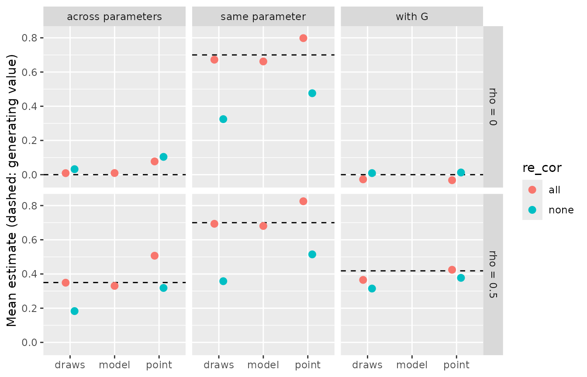
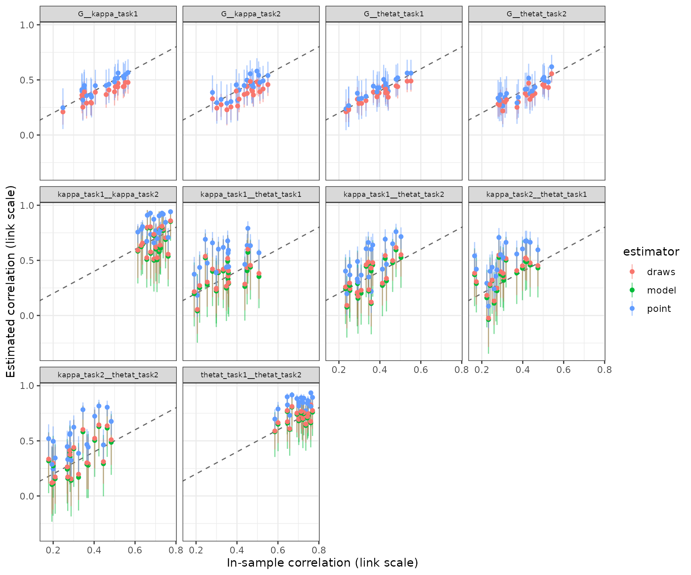

# Recovering between-subject correlations

A model that measures individual differences has to do more than order
people correctly on each of its parameters. Most substantive questions
are about how those differences relate: whether precision in one task
goes with precision in another, whether two parameters of the same model
are separable, or whether a parameter correlates with an ability
measured outside the model. [Validating a new bmm
model](https://www.gfrischkorn.org/bmmtools/articles/bmmtools.md) scored
how well subject estimates recover the subjects’ true values. This
article scores how well the correlations between them are recovered.

> **A first look, not a benchmark.** The results below come from one
> small simulation: four conditions, 20 replications each, 100 subjects
> per data set, fitted with four chains of 1,000 iterations, half of
> them warmup. At that length many fits miss the usual convergence
> standard, and we score them under a looser one (see
> [Convergence](#convergence)). The results show how the tools work and
> in which direction each estimator errs. They are not a calibrated
> recommendation for study design. A more comprehensive simulation will
> replace this article once the package is stable.

To run the code you need bmm, brms, a working
[cmdstanr](https://mc-stan.org/cmdstanr/) installation and, for the SEM
part, lavaan. The output was computed once and saved, so this page was
built without Stan or lavaan. Simulating and fitting the grid took 265
minutes.

## Generating correlated people

``` r

library(bmmtools)

model <- bmm::mixture2p(resp_error = "y")
pars <- c(kappa = log(8), thetat = qlogis(0.75))
sds <- c(kappa = 0.3, thetat = 0.5)
```

The model is bmm’s two-parameter mixture model, with population values
and between-subject SDs on the link scale as in [Validating a new bmm
model](https://www.gfrischkorn.org/bmmtools/articles/bmmtools.md). Each
simulated subject does two tasks with 100 trials each, so there are four
subject-level terms, `kappa` and `thetat` in task 1 and task 2, and one
observed covariate `G`, standing in for an ability measured by a
separate test.

The correlations among these five variables come from a factor model:

``` r

loadings <- matrix(
  c(
    sqrt(0.7), sqrt(0.7), 0, 0, 0,
    0, 0, sqrt(0.7), sqrt(0.7), 0,
    0, 0, 0, 0, 1
  ),
  ncol = 3,
  dimnames = list(
    c("kappa_task1", "kappa_task2", "thetat_task1", "thetat_task2", "G"),
    c("precision", "memory", "ability")
  )
)
factor_cors <- function(rho) {
  phi <- matrix(rho, 3, 3, dimnames = rep(list(colnames(loadings)), 2))
  diag(phi) <- 1
  phi
}
cors_for <- function(row) cors_from_factors(loadings, factor_cors(row$rho))
round(cors_for(data.frame(rho = 0.5)), 2)
#>              kappa_task1 kappa_task2 thetat_task1 thetat_task2    G
#> kappa_task1         1.00        0.70         0.35         0.35 0.42
#> kappa_task2         0.70        1.00         0.35         0.35 0.42
#> thetat_task1        0.35        0.35         1.00         0.70 0.42
#> thetat_task2        0.35        0.35         0.70         1.00 0.42
#> G                   0.42        0.42         0.42         0.42 1.00
```

[`cors_from_factors()`](https://www.gfrischkorn.org/bmmtools/reference/cors_from_factors.md)
turns loadings and factor correlations into the implied correlation
matrix. The two tasks load \\\sqrt{.7}\\ on a factor per parameter,
`precision` for `kappa` and `memory` for `thetat`, and `G` loads 1 on
its own factor `ability`. All three factors correlate \\\rho\\. This
gives three kinds of pairs with known values:

- **the same parameter across tasks**, \\.7\\ at every \\\rho\\;
- **different parameters**, \\.7\rho\\, so \\.35\\ at \\\rho = .5\\;
- **a parameter with `G`**, \\\sqrt{.7}\\\rho\\, so \\.42\\ at \\\rho =
  .5\\.

We used a factor model, rather than one correlation for every pair, for
two reasons. First, the article can then separate the correlation
between two terms, which the estimators below score, from the
correlation between the latent factors, which a structural equation
model recovers. Second, the factor model keeps that SEM identified even
at \\\rho = 0\\, because the two tasks of one parameter still correlate
\\.7\\.

## Three estimators

[`extract_correlations()`](https://www.gfrischkorn.org/bmmtools/reference/extract_correlations.md)
offers three answers to the question of how two subject-level terms
correlate:

- `"model"` is the correlation of the random effects the model
  estimates. It exists only when the random effects of the two terms
  share a correlation block, `(1 | p | id)`.
- `"draws"` correlates the subjects’ values within each posterior draw
  and summarises these correlations like any other posterior, with the
  median and a 95% equal-tailed credible interval (CrI).
- `"point"` correlates the subjects’ posterior means, with a Fisher-z
  interval that treats the means as if they were observed values.

They target different quantities. `model` estimates the correlation in
the population the subjects come from. `draws` describes the subjects in
the data set: its interval reflects uncertainty about their values, not
about which subjects happened to be sampled. `point` is a correlation of
estimates, and so it inherits whatever shrinkage and estimation error
those estimates carry.
[`recover_correlations()`](https://www.gfrischkorn.org/bmmtools/reference/recover_correlations.md)
therefore scores each estimate against two truths: `true_value`, the
generating correlation, and `sample_value`, the correlation the
simulated subjects actually had.

## The grid

``` r

grid <- expand.grid(
  rho = c(0, 0.5),
  re_cor = c("none", "all"),
  stringsAsFactors = FALSE
)
grid$n_subjects <- 100
grid$n_trials <- 100
grid
```

The grid crosses the factor correlation, \\\rho = 0\\ or \\.5\\, with
the random-effects structure of the fitted model. Under
`re_cor = "none"` every term has its own random intercept and the model
assumes the terms are uncorrelated. Under `re_cor = "all"` the four
terms share one correlation block, so the model estimates their
correlations.

``` r

out <- recovery_grid(
  model, grid, pars,
  dir = file.path(fits_dir, "correlation-recovery"),
  reps = 20,
  sds = sds, cors = cors_for,
  covariates = list(G = c(mean = 0, sd = 1)),
  tasks = c("1", "2"),
  formula = function(row) {
    recovery_formula(model, re_cor = row$re_cor, task_col = "task")
  },
  correlations = c("model", "draws", "point"),
  seed = 2026,
  chains = 4, iter = 1000, cores = 4, threads = brms::threading(3),
  backend = "cmdstanr", refresh = 0, silent = 2
)
```

`cors` and `formula` are functions of the grid row. `cors_for()` builds
the correlation matrix for the row’s \\\rho\\, and the formula function
reads the row’s `re_cor`, which is how one grid compares two model
specifications. `tasks` and `covariates` add the task dimension and `G`
to the simulated data. `correlations` asks the grid to extract all three
estimators from every fit; `model` rows exist only in the
`re_cor = "all"` cells. `threads` enables within-chain parallelisation
in brms; in a timing test with one 100-subject fit it cut the sampling
time from 499 to 238 seconds.

## Convergence

``` r

# The grid's own verdict uses check_convergence()'s defaults. At iter 1000
# many fits miss the usual bar (Rhat < 1.01, ESS > 400), mostly on the
# cor_ terms and a few of the 400 subject effects. The article scores the
# fits that pass the looser bar below and reports both verdicts.
bar <- list(rhat_max = 1.05, ess_bulk_min = 150, ess_tail_min = 150,
            divergent_max = 0)
strict_bar <- list(rhat_max = 1.01, ess_bulk_min = 400, ess_tail_min = 400,
                   divergent_max = 0)
convergence <- dplyr::bind_rows(lapply(seq_len(nrow(cells)), function(i) {
  fit <- readRDS(cells$file[[i]])
  verdict <- rlang::exec(check_convergence, fit, !!!bar)
  strict <- rlang::exec(check_convergence, fit, !!!strict_bar)
  tibble::tibble(
    condition = cells$condition[[i]],
    replication = cells$replication[[i]],
    verdict,
    pass_strict = strict$pass
  )
}))
kept <- convergence[convergence$pass, c("condition", "replication")]
dplyr::summarise(
  convergence,
  fits = dplyr::n(), pass = sum(pass), pass_strict = sum(pass_strict),
  .by = condition
)
```

    #> # A tibble: 4 × 10
    #>   condition   rho re_cor  fits  pass pass_strict max_rhat min_ess_bulk min_ess_tail
    #>   <chr>     <dbl> <chr>  <int> <int>       <int>    <dbl>        <dbl>        <dbl>
    #> 1 row-1       0   none      20    20           4     1.02         357.         626.
    #> 2 row-2       0.5 none      20    20           2     1.02         338.         648.
    #> 3 row-3       0   all       20    20           2     1.03         173.         333.
    #> 4 row-4       0.5 all       20    20           4     1.02         244.         466.
    #> # ℹ 1 more variable: n_divergent <int>

Under the usual standard, Rhat below 1.01, bulk and tail ESS above 400
and no divergent transitions, only 12 of the 80 fits pass. None had a
divergent transition or hit the maximum tree depth; they fall short on
Rhat and ESS, and not by much. The worst Rhat is 1.03, the smallest bulk
ESS 173 and the smallest tail ESS 333. We therefore score every fit with
Rhat below 1.05 and bulk and tail ESS above 150, which all 80 fits meet.

The shortfall is concentrated in a few variables:

``` r

# Where the fits miss the strict bar: per fit and group of variables, how
# many variables do.
variable_group <- function(variable) {
  dplyr::case_when(
    startsWith(variable, "b_") ~ "population",
    startsWith(variable, "sd_") ~ "sd",
    startsWith(variable, "cor_") ~ "cor",
    startsWith(variable, "r_") ~ "subject"
  )
}
convergence_groups <- dplyr::bind_rows(lapply(
  seq_len(nrow(cells)), function(i) {
    draws <- posterior::subset_draws(
      posterior::as_draws_df(readRDS(cells$file[[i]])),
      variable = "^(b|sd|cor|r)_", regex = TRUE
    )
    diag <- posterior::summarise_draws(draws, "rhat", "ess_bulk", "ess_tail")
    # a variable that is constant across draws has no rhat
    diag <- diag[!is.na(diag$rhat), ]
    diag$group <- variable_group(diag$variable)
    dplyr::summarise(
      diag,
      condition = cells$condition[[i]],
      replication = cells$replication[[i]],
      n_variables = dplyr::n(),
      n_rhat = sum(rhat >= strict_bar$rhat_max),
      n_ess = sum(ess_bulk <= strict_bar$ess_bulk_min |
                    ess_tail <= strict_bar$ess_tail_min),
      max_rhat = max(rhat),
      min_ess_bulk = min(ess_bulk),
      .by = group
    )
  }
))
dplyr::summarise(
  convergence_groups,
  fits_rhat = sum(n_rhat > 0), fits_ess = sum(n_ess > 0),
  max_rhat = max(max_rhat), min_ess_bulk = min(min_ess_bulk),
  .by = c(condition, group)
)
```

    #> # A tibble: 7 × 7
    #>   re_cor group       fits fits_rhat fits_ess max_rhat min_ess_bulk
    #>   <chr>  <chr>      <int>     <int>    <int>    <dbl>        <dbl>
    #> 1 none   population    40         6        1     1.02         398.
    #> 2 none   sd            40         8        0     1.02         465.
    #> 3 none   subject       40        26        0     1.01        1062.
    #> 4 all    population    40         1        0     1.01         485.
    #> 5 all    sd            40         0        0     1.01         551.
    #> 6 all    cor           40        20       19     1.03         173.
    #> 7 all    subject       40        13        0     1.01         416.

In the `re_cor = "all"` cells, 20 of 40 fits have a correlation
parameter with Rhat of 1.01 or above, and 19 have one with ESS at or
below 400. The smallest bulk ESS of any correlation parameter is 173.
These are the draws the `model` estimator summarises, so its intervals
below rest on fewer effective draws than the other estimators’. In the
`re_cor = "none"` cells, 26 of 40 fits have at least one of their 400
subject-level terms with Rhat of 1.01 or above, 8 an SD and 6 a
population parameter. Longer chains are the obvious remedy. For a
simulation meant to show the direction of errors rather than exact
calibration, we did not run them.

## Scoring

``` r

design <- data.frame(condition = sprintf("row-%d", seq_len(nrow(grid))), grid)
cors_all <- attr(out, "correlations")
cors <- dplyr::semi_join(cors_all, kept, by = c("condition", "replication"))
cor_summary <- dplyr::left_join(summary(cors), design, by = "condition")
cor_summary
```

[`summary()`](https://rdrr.io/r/base/summary.html) of the correlation
recovery has one row per condition, pair and estimator. With ten pairs,
three estimators and four conditions this is a long table, so we average
it within the three kinds of pairs:

``` r

pair_type <- function(term) {
  dplyr::case_when(
    grepl("(^|__)G(__|$)", term) ~ "with G",
    grepl("^kappa.*__kappa|^thetat.*__thetat", term) ~ "same parameter",
    TRUE ~ "across parameters"
  )
}
by_type <- res$cor_summary |>
  dplyr::mutate(pair_type = pair_type(term)) |>
  dplyr::summarise(
    true_value = mean(true_value),
    mean_estimate = mean(mean_estimate),
    bias = mean(bias),
    coverage = mean(coverage),
    coverage_sample = mean(coverage_sample),
    rejection_rate = mean(rejection_rate),
    ci_width = mean(ci_width),
    .by = c(pair_type, rho, re_cor, estimator)
  )
print(by_type, n = Inf)
#> # A tibble: 28 × 11
#>    pair_type           rho re_cor estimator true_value mean_estimate      bias coverage
#>    <chr>             <dbl> <chr>  <chr>          <dbl>         <dbl>     <dbl>    <dbl>
#>  1 same parameter      0   none   draws          0.7         0.325   -0.375       0    
#>  2 across parameters   0   none   draws          0           0.0321   0.0321      0.988
#>  3 with G              0   none   draws          0           0.00916  0.00916     0.762
#>  4 same parameter      0   none   point          0.7         0.476   -0.224       0.1  
#>  5 across parameters   0   none   point          0           0.104    0.104       0.888
#>  6 with G              0   none   point          0           0.0127   0.0127      0.962
#>  7 same parameter      0.5 none   draws          0.7         0.358   -0.342       0    
#>  8 across parameters   0.5 none   draws          0.35        0.183   -0.167       0.363
#>  9 with G              0.5 none   draws          0.418       0.315   -0.104       0.475
#> 10 same parameter      0.5 none   point          0.7         0.515   -0.185       0.175
#> 11 across parameters   0.5 none   point          0.35        0.318   -0.0316      0.925
#> 12 with G              0.5 none   point          0.418       0.377   -0.0409      0.888
#> 13 same parameter      0   all    model          0.7         0.662   -0.0381      0.975
#> 14 across parameters   0   all    model          0           0.00953  0.00953     0.975
#> 15 same parameter      0   all    draws          0.7         0.672   -0.0278      0.925
#> 16 across parameters   0   all    draws          0           0.00894  0.00894     0.925
#> 17 with G              0   all    draws          0          -0.0274  -0.0274      0.75 
#> 18 same parameter      0   all    point          0.7         0.798    0.0983      0.4  
#> 19 across parameters   0   all    point          0           0.0773   0.0773      0.75 
#> 20 with G              0   all    point          0          -0.0324  -0.0324      0.962
#> 21 same parameter      0.5 all    model          0.7         0.681   -0.0193      1    
#> 22 across parameters   0.5 all    model          0.35        0.330   -0.0195      0.962
#> 23 same parameter      0.5 all    draws          0.7         0.693   -0.00655     0.975
#> 24 across parameters   0.5 all    draws          0.35        0.349   -0.000929    0.85 
#> 25 with G              0.5 all    draws          0.418       0.365   -0.0530      0.675
#> 26 same parameter      0.5 all    point          0.7         0.825    0.125       0.35 
#> 27 across parameters   0.5 all    point          0.35        0.507    0.157       0.488
#> 28 with G              0.5 all    point          0.418       0.425    0.00628     0.962
#> # ℹ 3 more variables: coverage_sample <dbl>, rejection_rate <dbl>, ci_width <dbl>
```

`rejection_rate` is the share of replications whose interval excludes
zero: the false-positive rate where the true correlation is 0 and the
power where it is not. [Recovery summary
columns](https://www.gfrischkorn.org/bmmtools/articles/metrics.md)
defines the other columns.

``` r

library(ggplot2)
ggplot(
  by_type,
  aes(estimator, mean_estimate, colour = re_cor)
) +
  geom_hline(aes(yintercept = true_value), linetype = "dashed") +
  geom_point(size = 2.5, position = position_dodge(width = 0.4)) +
  facet_grid(paste("rho =", rho) ~ pair_type) +
  labs(
    x = NULL, y = "Mean estimate (dashed: generating value)",
    colour = "re_cor"
  )
```



**The same parameter across tasks.** The generating correlation is .70.
A model without correlated random effects shrinks each subject towards
the mean of that term alone, and both estimators are attenuated: `draws`
gives .36 and `point` .51 at \\\rho = .5\\. With correlated random
effects, `model` and `draws` recover the correlation, at .68 and .69.
`point` now overshoots, at .83, and because its interval is narrow (mean
width .13) it covers the generating value in only .35 of the
replications. A likely reason is that the correlated model shrinks each
subject towards the correlation it estimates, so the posterior means
line up more closely than the true values do.

**Different parameters.** At \\\rho = 0\\ this pair type measures false
positives. Under `re_cor = "all"`, `point` excludes zero in .25 of the
replications, against .07 for `draws` and .02 for `model`. At \\\rho =
.5\\ (generating value .35) the same pattern holds: `draws` and `model`
are close, .35 and .33, and `point` is inflated to .51. Under
`re_cor = "none"`, `draws` is attenuated to .18, while `point` lands
near the truth at .32. However, the same `point` estimator gives .10
where the truth is 0, so this is not an unbiased estimator but, in this
design, an attenuation and an upward bias that partly cancel.

**A parameter with `G`.** Here `point` is the best calibrated estimator.
At \\\rho = 0\\ it excludes zero in .04 of the replications under
`re_cor = "all"`, and at \\\rho = .5\\ its mean is .42 against a
generating value of .42, covered in .96 of the replications. `draws`
excludes zero in .25 of the replications at \\\rho = 0\\. This follows
from its target: its interval covers the correlation these 100 subjects
actually had in .97 of the replications. A sample of 100 subjects has a
correlation with `G` that differs from 0 by chance, and the `draws`
interval, which carries no uncertainty about which subjects were
sampled, is narrow enough (mean width .21) to detect it.

Taken together, in this design, correlations between parameters of one
model were best recovered by fitting correlated random effects and
reading `model` or `draws`. Correlating posterior means from that model
overstated the correlations and inflated false positives. For a
correlation with an observed covariate, `point` answered the population
question and `draws` the in-sample one.

[`plot_recovery()`](https://www.gfrischkorn.org/bmmtools/reference/plot_recovery.md)
shows the replications of one cell, each estimate against the
correlation the subjects actually had:

``` r

plot_recovery(dplyr::filter(cors, condition == "row-4"), truth = "sample") +
  ggplot2::theme(strip.text = ggplot2::element_text(size = 7))
```



## The SEM route

A second way to estimate a latent correlation is to take the subject
estimates out of the model and fit a structural equation model to them.
[`subject_table()`](https://www.gfrischkorn.org/bmmtools/reference/subject_table.md)
returns one row per subject with the true and estimated value of every
term and the covariates:

``` r

tab <- subject_table(out, point = "median")
tab <- dplyr::semi_join(tab, kept, by = c("condition", "replication"))
tab
```

``` r

stopifnot(requireNamespace("lavaan", quietly = TRUE))
# Two indicators per factor are identified only through the factor's
# correlations with the rest of the model, which vanish at rho = 0, so the
# two tasks share a loading: they are parallel by construction. kappa and
# thetat of one task are estimated from the same trials, so their
# estimation errors covary; the residual covariances take that up.
cfa_model <- "
  precision =~ l1 * est_kappa_task1 + l1 * est_kappa_task2
  memory    =~ l2 * est_thetat_task1 + l2 * est_thetat_task2
  est_kappa_task1 ~~ est_thetat_task1
  est_kappa_task2 ~~ est_thetat_task2
  precision ~~ memory + G
  memory    ~~ G
"
# Every fit is kept with its status: warnings are recorded, not dropped.
factor_correlations <- function(data, model, factors) {
  warnings <- character()
  fit <- withCallingHandlers(
    tryCatch(
      lavaan::cfa(model, data = data, std.lv = TRUE),
      error = function(e) e
    ),
    warning = function(w) {
      warnings <<- c(warnings, conditionMessage(w))
      invokeRestart("muffleWarning")
    }
  )
  status <- if (inherits(fit, "error")) {
    "error"
  } else if (!lavaan::lavInspect(fit, "converged")) {
    "not converged"
  } else if (length(warnings) > 0) {
    "warning"
  } else {
    "ok"
  }
  if (status %in% c("error", "not converged")) {
    return(data.frame(
      pair = NA_character_, estimate = NA_real_, ci_low = NA_real_,
      ci_high = NA_real_, status = status,
      message = paste(c(conditionMessage(fit)[inherits(fit, "error")],
                        warnings), collapse = " | ")
    ))
  }
  sol <- lavaan::standardizedSolution(fit)
  sol <- sol[sol$op == "~~" & sol$lhs %in% factors & sol$lhs != sol$rhs, ]
  data.frame(
    pair = paste(sol$lhs, sol$rhs, sep = "__"),
    estimate = sol$est.std,
    ci_low = sol$ci.lower,
    ci_high = sol$ci.upper,
    status = status,
    message = paste(unique(trimws(warnings)), collapse = " | ")
  )
}
lavaan_grid <- dplyr::bind_rows(
  lapply(split(tab, ~ condition + replication, drop = TRUE), function(d) {
    fc <- factor_correlations(d, cfa_model, c("precision", "memory"))
    cbind(d[1, c("condition", "replication")], fc, row.names = NULL)
  })
)
lavaan_grid <- dplyr::left_join(lavaan_grid, design, by = "condition")
lavaan_status <- dplyr::count(
  dplyr::distinct(lavaan_grid, condition, replication, status),
  condition, status
)
lavaan_grid_summary <- dplyr::summarise(
  dplyr::filter(lavaan_grid, !is.na(pair)),
  n_fits = dplyr::n(),
  n_warning = sum(status == "warning"),
  mean_estimate = mean(estimate),
  sd_estimate = stats::sd(estimate),
  # every latent correlation is rho: G loads 1 on its own factor
  coverage = mean(ci_low <= rho & ci_high >= rho),
  .by = c(condition, rho, re_cor, pair)
)
lavaan_status
lavaan_grid_summary
```

The CFA mirrors the generating model. Each parameter’s two tasks load on
one factor with equal loadings, `G` is observed, and within a task the
residuals of `kappa` and `thetat` covary, because both are estimated
from the same trials. Every fit is kept with its status:

    #>   condition  status  n
    #> 1     row-1      ok 20
    #> 2     row-2      ok 20
    #> 3     row-3      ok  7
    #> 4     row-3 warning 13
    #> 5     row-4      ok  5
    #> 6     row-4 warning 15
    #>    condition rho re_cor              pair n_fits n_warning mean_estimate sd_estimate
    #> 1      row-1 0.0   none precision__memory     20         0         0.248       0.132
    #> 2      row-1 0.0   none      precision__G     20         0         0.050       0.157
    #> 3      row-1 0.0   none         memory__G     20         0        -0.006       0.124
    #> 4      row-2 0.5   none precision__memory     20         0         0.597       0.152
    #> 5      row-2 0.5   none      precision__G     20         0         0.524       0.109
    #> 6      row-2 0.5   none         memory__G     20         0         0.522       0.110
    #> 7      row-3 0.0    all precision__memory     20        13         0.027       0.206
    #> 8      row-3 0.0    all      precision__G     20        13        -0.037       0.069
    #> 9      row-3 0.0    all         memory__G     20        13        -0.032       0.111
    #> 10     row-4 0.5    all precision__memory     20        15         0.574       0.194
    #> 11     row-4 0.5    all      precision__G     20        15         0.438       0.117
    #> 12     row-4 0.5    all         memory__G     20        15         0.401       0.113
    #>    coverage
    #> 1      0.85
    #> 2      0.90
    #> 3      1.00
    #> 4      0.85
    #> 5      0.95
    #> 6      0.85
    #> 7      0.70
    #> 8      1.00
    #> 9      0.95
    #> 10     0.45
    #> 11     0.80
    #> 12     0.70

Under `re_cor = "none"` all 40 CFAs fit without warnings. The
correlations with `G` are recovered, at .52 and .52 for a latent .5, and
.05 and -.01 for 0. The correlation between the two parameter factors is
not: it is .25 where the factors are uncorrelated and .60 where they
correlate .5. This is consistent with the upward bias of `point` between
parameters seen above, which the CFA then corrects for attenuation and
so enlarges.

Under `re_cor = "all"`, 13 of 20 CFAs at \\\rho = 0\\ and 15 of 20 at
\\\rho = .5\\ end with a warning: negative residual variances or a
residual covariance matrix that is not positive definite. The factor
correlation varies widely between replications, with an SD of .19 at
\\\rho = .5\\, and its 95% confidence interval covers .5 in .45 of them.
One explanation, which this simulation does not test, is that posterior
means from a model with correlated random effects already carry the
correlation the model estimated, and a CFA on them has little room left
to model it again.

In this design, the two-step route recovers correlations with an
observed covariate but not the correlation between two parameters of the
same model. lavaan ran in the precompute script; it is not a dependency
of bmmtools.

## Several models, separate fits

Sometimes the terms come from different models, fitted separately:
precision in a visual working memory task and in a verbal one, each with
its own `bmm` fit.
[`recovery_component()`](https://www.gfrischkorn.org/bmmtools/reference/recovery_component.md)
describes one model,
[`simulate_components()`](https://www.gfrischkorn.org/bmmtools/reference/simulate_components.md)
draws correlated subjects across several, and
[`fit_components()`](https://www.gfrischkorn.org/bmmtools/reference/fit_components.md)
fits each:

``` r

a <- recovery_component(model, pars, n_trials = 100, sds = sds, name = "a")
b <- recovery_component(model, pars, n_trials = 100, sds = sds, name = "b")
set_loadings <- loadings
rownames(set_loadings) <- c("a_kappa", "b_kappa", "a_thetat", "b_thetat", "G")
set <- simulate_components(
  list(a, b),
  n_subjects = 100,
  cors = cors_from_factors(set_loadings, factor_cors(0.5)),
  covariates = list(G = c(mean = 0, sd = 1)),
  seed = 2026
)
set$truth$cor
```

``` r

fits <- fit_components(
  set,
  dir = file.path(fits_dir, "correlation-recovery-components"),
  chains = 4, iter = 1000, cores = 4, threads = brms::threading(3),
  backend = "cmdstanr", refresh = 0, silent = 2
)
set_convergence <- dplyr::bind_rows(
  lapply(fits, function(fit) {
    verdict <- rlang::exec(check_convergence, fit, !!!bar)
    verdict$pass_strict <- rlang::exec(check_convergence, fit, !!!strict_bar)$pass
    verdict
  }),
  .id = "component"
)
set_convergence
```

    #> # A tibble: 2 × 10
    #>   component max_rhat min_ess_bulk min_ess_tail n_divergent n_max_treedepth n_variables
    #>   <chr>        <dbl>        <dbl>        <dbl>       <int>           <int>       <int>
    #> 1 a             1.01         543.         882.           0               0         206
    #> 2 b             1.01         525.         980.           0               0         206
    #> # ℹ 3 more variables: pass <lgl>, failed <chr>, pass_strict <lgl>

This example is a single data set of 100 subjects at \\\rho = .5\\, so
its numbers illustrate the arithmetic rather than estimate a bias. Both
fits pass the looser bar; fit `a` misses the strict one on Rhat.

``` r

set_recovery <- recover_correlations(fits, set, estimator = c("draws", "point"))
set_summary <- summary(set_recovery)
set_summary
```

``` r

set_tab <- subject_table(set, fits)
terms <- c("a_kappa", "b_kappa", "a_thetat", "b_thetat")
reliability <- vapply(
  terms,
  function(term) {
    true <- set_tab[[paste0("true_", term)]]
    est <- set_tab[[paste0("est_", term)]]
    stats::cor(true, est)^2
  },
  numeric(1)
)
pairs <- c("a_kappa__b_kappa", "a_thetat__b_thetat")
attenuation <- set_summary[set_summary$term %in% pairs, ]
attenuation$rel_a <- reliability[sub("__.*", "", attenuation$term)]
attenuation$rel_b <- reliability[sub(".*__", "", attenuation$term)]
attenuation$expected <- ifelse(
  attenuation$estimator == "point",
  attenuation$true_value * sqrt(attenuation$rel_a * attenuation$rel_b),
  attenuation$true_value * attenuation$rel_a * attenuation$rel_b
)
attenuation$disattenuated <- attenuation$mean_estimate / ifelse(
  attenuation$estimator == "point",
  sqrt(attenuation$rel_a * attenuation$rel_b),
  attenuation$rel_a * attenuation$rel_b
)
attenuation[, c("term", "estimator", "true_value", "mean_estimate",
                "rel_a", "rel_b", "expected", "disattenuated")]
```

    #> # A tibble: 4 × 8
    #>   term               estimator true_value mean_estimate rel_a rel_b expected disattenuated
    #>   <chr>              <chr>          <dbl>         <dbl> <dbl> <dbl>    <dbl>         <dbl>
    #> 1 a_kappa__b_kappa   draws            0.7         0.265 0.671 0.584    0.274         0.675
    #> 2 a_thetat__b_thetat draws            0.7         0.425 0.715 0.764    0.382         0.778
    #> 3 a_kappa__b_kappa   point            0.7         0.402 0.671 0.584    0.438         0.642
    #> 4 a_thetat__b_thetat point            0.7         0.612 0.715 0.764    0.517         0.827

Neither fit knows about the other model’s subjects, so a correlation
across fits is attenuated by the reliabilities of the two subject
estimates. Here the reliability is the squared correlation of true and
estimated values, between .58 and .76. For `kappa` the generating
correlation of .70 comes out as .40 with `point` and .26 with `draws`,
close to the expected .44 for \\\rho\sqrt{rel_a\\rel_b}\\ and .27 for
\\\rho\\rel_a\\rel_b\\. Dividing by those factors gives .64 and .67. For
`thetat` both estimates lie above the expected values, .61 against .52
and .42 against .38, and their disattenuated values, .83 and .78,
overshoot .70. A single data set cannot tell whether this is noise. In
practice the reliabilities are not known and would have to be estimated
as well.

``` r

# Within each model, kappa and thetat come from the same fit and trials,
# so their estimation errors covary.
cfa_set <- "
  precision =~ est_a_kappa + est_b_kappa
  memory    =~ est_a_thetat + est_b_thetat
  est_a_kappa ~~ est_a_thetat
  est_b_kappa ~~ est_b_thetat
  precision ~~ memory + G
  memory    ~~ G
"
lavaan_set <- factor_correlations(set_tab, cfa_set, c("precision", "memory"))
lavaan_set
```

    #>                pair estimate ci_low ci_high status
    #> 1 precision__memory    0.806  0.578   1.035     ok
    #> 2      precision__G    0.546  0.333   0.759     ok
    #> 3         memory__G    0.390  0.194   0.586     ok

The CFA on the separate fits recovers the correlations with `G`, .55 and
.39, and overestimates the correlation of the two parameter factors at
.81, the same direction as in the grid. A joint multivariate fit of both
models would estimate these correlations directly; bmmtools does not
support that yet.

## Which function does what

| Step | Function | Returns |
|----|----|----|
| truth | [`cors_from_factors()`](https://www.gfrischkorn.org/bmmtools/reference/cors_from_factors.md) | a correlation matrix implied by a factor model |
| simulate | [`simulate_recovery()`](https://www.gfrischkorn.org/bmmtools/reference/simulate_recovery.md), [`simulate_components()`](https://www.gfrischkorn.org/bmmtools/reference/simulate_components.md) | data and truth, with tasks and covariates |
| formula | `recovery_formula(re_cor = )` | random intercepts, correlated or not |
| fit | [`fit_cached()`](https://www.gfrischkorn.org/bmmtools/reference/fit_cached.md), [`fit_components()`](https://www.gfrischkorn.org/bmmtools/reference/fit_components.md) | fits, reused while nothing changed |
| gate | [`check_convergence()`](https://www.gfrischkorn.org/bmmtools/reference/check_convergence.md) | diagnostics and a verdict under your thresholds |
| extract | [`extract_correlations()`](https://www.gfrischkorn.org/bmmtools/reference/extract_correlations.md) | `model`, `draws` and `point` correlations |
| score | [`recover_correlations()`](https://www.gfrischkorn.org/bmmtools/reference/recover_correlations.md) | estimates against true and sample correlations |
| summarise | [`summary()`](https://rdrr.io/r/base/summary.html) | one row per pair, estimator and condition |
| two-step | [`subject_table()`](https://www.gfrischkorn.org/bmmtools/reference/subject_table.md) | true and estimated values per subject, for an SEM |
| loop | `recovery_grid(correlations = )` | all of the above over a design grid |
