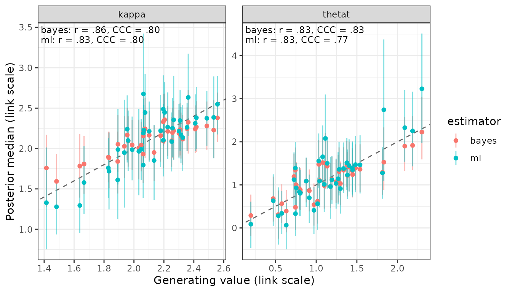
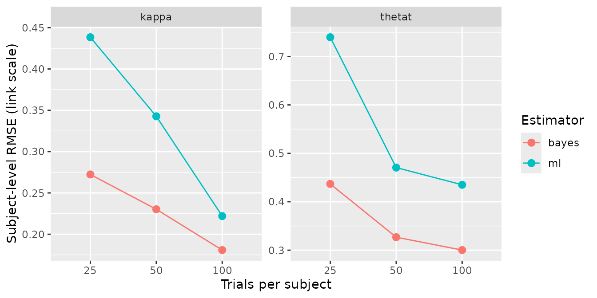

# Hierarchical estimation against subject-wise maximum likelihood

A hierarchical model estimates each subject partly from that subject’s
own data and partly from everyone else’s. That this buys accuracy is
easy to assert and rarely measured on the model in front of you. This
article measures it for one bmm model: the same simulated data fitted
twice, once hierarchically and once subject by subject with no pooling,
and scored once against the generating values that produced it.

[`fit_ml()`](https://www.gfrischkorn.org/bmmtools/reference/fit_ml.md)
is the second fit. It exists for this comparison and not for inference:
bmm’s own discussion of subject-wise maximum likelihood records the wish
that users not apply it for inference, and bmmtools does not recommend
it either. What it is good for is a baseline, and a baseline is what
turns “hierarchical estimation helps” into a number.

The comparison is the one [Recovery summary
columns](https://www.gfrischkorn.org/bmmtools/articles/metrics.html#reading-the-concordance)
works through algebraically for a conjugate normal model. Here the same
quantities come out of a real bmm model, a real sampler and the
package’s own scorers.

## The data

The data set is the one [Validating a new bmm
model](https://www.gfrischkorn.org/bmmtools/articles/bmmtools.md) walks
through: `mixture2p`, 40 subjects, 100 trials each, subjects drawn
around a population value on the link scale.

``` r

library(bmmtools)

model <- bmm::mixture2p(resp_error = "y")
pars <- c(kappa = log(8), thetat = qlogis(0.75))
sds <- c(kappa = 0.3, thetat = 0.5)

sim <- simulate_recovery(
  model,
  pars = pars, sds = sds,
  n_subjects = 40, n_trials = 100,
  seed = 1
)
```

## Two fits of it

The hierarchical fit gives every free parameter a random intercept over
`id`, which is what
[`recovery_formula()`](https://www.gfrischkorn.org/bmmtools/reference/recovery_formula.md)
writes:

``` r

fit <- fit_cached(
  recovery_formula(model), sim$data, model,
  file = file.path(fits_dir, "mixture2p-40x100"),
  seed = 1, chains = 4, iter = 2000, cores = 4, backend = "cmdstanr"
)
check_convergence(fit)

bayes <- extract_estimates(fit, level = "subject")
```

    #> # A tibble: 1 × 8
    #>   max_rhat min_ess_bulk min_ess_tail n_divergent n_max_treedepth n_variables pass  failed
    #>      <dbl>        <dbl>        <dbl>       <int>           <int>       <int> <lgl> <chr> 
    #> 1     1.01         970.        1786.           0               0          86 TRUE  ""

[`fit_ml()`](https://www.gfrischkorn.org/bmmtools/reference/fit_ml.md)
takes the hierarchy out. It writes `p ~ 0 + id` instead, so each subject
gets an independent set of parameters and nothing is shared between
them:

``` r

ml <- fit_ml(
  model, sim$data,
  file = file.path(fits_dir, "ml-mixture2p-40x100"),
  seed = 1, refresh = 0, silent = 2
)
ml
```

    #> <bmmtools_ml>
    #> 40 cells by id, 40 converged.
    #> Method: stan/laplace, flat priors.
    #> 2 parameters: kappa, thetat.
    #> 
    #> # A tibble: 80 × 13
    #>    term  estimate ci_low ci_high ci_method ci_level  rhat ess_bulk ess_tail level   id   
    #>    <chr>    <dbl>  <dbl>   <dbl> <chr>        <dbl> <dbl>    <dbl>    <dbl> <chr>   <chr>
    #>  1 kappa     1.61   1.13    2.09 laplace       0.95    NA       NA       NA subject 1    
    #>  2 kappa     1.85   1.36    2.29 laplace       0.95    NA       NA       NA subject 2    
    #>  3 kappa     1.76   1.39    2.13 laplace       0.95    NA       NA       NA subject 3    
    #>  4 kappa     2.55   2.17    2.90 laplace       0.95    NA       NA       NA subject 4    
    #>  5 kappa     2.22   1.77    2.66 laplace       0.95    NA       NA       NA subject 5    
    #>  6 kappa     1.72   1.25    2.20 laplace       0.95    NA       NA       NA subject 6    
    #>  7 kappa     2.26   1.87    2.69 laplace       0.95    NA       NA       NA subject 7    
    #>  8 kappa     2.22   1.88    2.55 laplace       0.95    NA       NA       NA subject 8    
    #>  9 kappa     2.09   1.72    2.45 laplace       0.95    NA       NA       NA subject 9    
    #> 10 kappa     1.99   1.61    2.40 laplace       0.95    NA       NA       NA subject 10   
    #> # ℹ 70 more rows
    #> # ℹ 2 more variables: converged <lgl>, estimator <chr>

Two things about that fit are what keep it a fair opponent rather than a
straw man.

**The priors are flat.** Under bmm’s default priors the mode of a
no-pooling fit is a penalised estimate, and the comparison would become
hierarchical shrinkage against prior shrinkage, which is a different and
much weaker claim. `prior = "default"` is available and documented as
what it is.

**It is one fit, not forty.** Under `p ~ 0 + id` every free parameter
belongs to a single subject, so the log posterior is a sum of
per-subject terms and the joint mode is the vector of per-subject modes.
[`?fit_ml`](https://www.gfrischkorn.org/bmmtools/reference/fit_ml.md)
reports the check: the joint mode and independent optimisation of bmm’s
own density agreed to 3.0e-06 on the link scale.

## One truth, two estimators

There is no `compare_estimators()`. Both fits produce an estimates
tibble with the same columns, the rows carry an `estimator` column, and
binding them is the join:

``` r

both <- dplyr::bind_rows(bayes, ml)
table(both$estimator, both$term)
```

    #>        
    #>         kappa thetat
    #>   bayes    40     40
    #>   ml       40     40

[`recover_subjects()`](https://www.gfrischkorn.org/bmmtools/reference/recover.md)
then scores all 160 rows against the one set of generating values, and
[`summary()`](https://rdrr.io/r/base/summary.html) groups by `estimator`
instead of pooling the two into a single bias and RMSE:

``` r

scored_link <- recover_subjects(both, sim$truth$subjects, scale = "link")
summary(scored_link)
```

    #> # A tibble: 4 × 8
    #>   term   estimator     n     bias  rmse coverage ci_width     r
    #>   <chr>  <chr>     <dbl>    <dbl> <dbl>    <dbl>    <dbl> <dbl>
    #> 1 kappa  bayes        40 -0.00296 0.143    1        0.668 0.858
    #> 2 thetat bayes        40 -0.0237  0.260    0.975    1.08  0.830
    #> 3 kappa  ml           40 -0.00295 0.193    1        0.855 0.829
    #> 4 thetat ml           40  0.0424  0.385    0.925    1.33  0.829
    #> # A tibble: 4 × 7
    #>   term   estimator     r   ccc ccc_scale_shift calibration_slope truth_sd
    #>   <chr>  <chr>     <dbl> <dbl>           <dbl>             <dbl>    <dbl>
    #> 1 kappa  bayes     0.858 0.797           0.680             1.26     0.263
    #> 2 thetat bayes     0.830 0.827           0.936             0.887    0.457
    #> 3 kappa  ml        0.829 0.800           1.31              0.635    0.263
    #> 4 thetat ml        0.829 0.772           1.45              0.571    0.457

That is one [`summary()`](https://rdrr.io/r/base/summary.html) object,
printed twice over different columns; all 23 are defined in [Recovery
summary
columns](https://www.gfrischkorn.org/bmmtools/articles/metrics.md).

`scale = "link"` is deliberate here. The link scale is the one the model
is estimated on and the one the shrinkage argument is about; the natural
scale comes back below, and it does not tell the same story.

## What the table says

**RMSE falls and the correlation does not.** Subject-level RMSE goes
from 0.193 to 0.143 on `kappa` and from 0.385 to 0.260 on `thetat`,
while `r` moves from 0.829 to 0.858 and from 0.829 to 0.830. This is the
shape the conjugate table in [Recovery summary
columns](https://www.gfrischkorn.org/bmmtools/articles/metrics.md) shows
with exact posterior means: the same ordering of subjects, recovered
with less error.

**They differ far more in spread than in rank.** `ccc_scale_shift` is
the standard deviation of the estimates over the standard deviation of
the truth. Printed rather than inferred:

``` r

spread <- dplyr::summarise(
  scored_link,
  sd_estimate = sd(estimate, na.rm = TRUE),
  sd_truth = sd(true_value, na.rm = TRUE),
  ratio = sd(estimate, na.rm = TRUE) / sd(true_value, na.rm = TRUE),
  .by = c(term, estimator)
)
spread
```

    #> # A tibble: 4 × 5
    #>   term   estimator sd_estimate sd_truth ratio
    #>   <chr>  <chr>           <dbl>    <dbl> <dbl>
    #> 1 kappa  bayes           0.181    0.266 0.680
    #> 2 thetat bayes           0.433    0.463 0.936
    #> 3 kappa  ml              0.347    0.266 1.31 
    #> 4 thetat ml              0.672    0.463 1.45

The maximum-likelihood estimates spread wider than the subjects they
estimate, because each one carries its own measurement error and nothing
pulls it back. The hierarchical estimates spread narrower, because each
is pulled towards the population mean by an amount the model infers from
how noisy that subject’s data are.

**`ccc` does not settle it, and that is a property of `ccc`.** On
`kappa` Lin’s concordance is 0.800 for maximum likelihood against 0.797
for the hierarchical fit, the wrong way round from the RMSE. Lin’s
bias-correction factor treats a scale shift of \\v\\ and one of \\1/v\\
alike, so \\\rho_c\\ cannot distinguish calibrated shrinkage from none
and mildly rewards too little of it. [Recovery summary
columns](https://www.gfrischkorn.org/bmmtools/articles/metrics.html#reading-the-concordance)
derives this for the conjugate case, where it shows up as .691 against
.657; here it survives contact with a real model. Read `ccc` next to
`rmse`, never instead of it.

**One replication is a coarse instrument for `calibration_slope`.** For
a calibrated posterior mean the slope of truth on estimate is 1.
Measured here it is 1.262 on `kappa` and 0.887 on `thetat`, against
0.635 and 0.571 for maximum likelihood. The direction is unambiguous and
the distance from 1 is not: the slope is \\r / v\\, and both are
estimated from 40 subjects in a single simulated data set. The design
grid below is where that number becomes readable.

A warning that applies to the whole table. `ccc_scale_shift` near 1 is
**not** the target for the hierarchical estimator. A calibrated
posterior mean has \\v = r\\, not \\v = 1\\; `calibration_slope` \\=
r/v\\ is the column to read against 1. This is documented in
[`?recovery_ccc`](https://www.gfrischkorn.org/bmmtools/reference/recovery_ccc.md)
and derived in [Recovery summary
columns](https://www.gfrischkorn.org/bmmtools/articles/metrics.html#reading-the-concordance).

``` r

plot_recovery(scored_link, color_by = "estimator", annotate = TRUE)
```



Both clouds sit on the identity line. The maximum-likelihood cloud is
longer along it and its intervals are wider.

## On the scale a reader interprets

The link scale is the honest one for comparing estimators. It is not the
one results are reported on. `kappa` is a concentration and `thetat` a
probability, and the hierarchical fit records its own link table while a
[`fit_ml()`](https://www.gfrischkorn.org/bmmtools/reference/fit_ml.md)
result does not, so scoring a bound tibble on the natural scale needs
the links supplied:

``` r

par_table <- bmm::parameters(model)
links <- stats::setNames(par_table$link, par_table$parameter)
links
```

    #>        mu1      kappa     thetat 
    #> "tan_half"      "log"    "logit"

``` r

scored <- recover_subjects(both, sim$truth$subjects, links = links)
summary(scored)
```

    #> # A tibble: 4 × 8
    #>   term   estimator     n     bias   rmse coverage     r calibration_slope
    #>   <chr>  <chr>     <dbl>    <dbl>  <dbl>    <dbl> <dbl>             <dbl>
    #> 1 kappa  bayes        40 -0.172   1.24      1     0.821             1.23 
    #> 2 thetat bayes        40 -0.00306 0.0480    0.975 0.815             0.815
    #> 3 kappa  ml           40  0.155   1.77      1     0.744             0.587
    #> 4 thetat ml           40 -0.00177 0.0620    0.925 0.816             0.605

`bias` on `kappa` is where the two scales part company. On the link
scale both estimators are near-unbiased, -0.0029 and -0.0030. On the
natural scale they are biased in opposite directions, 0.155 for maximum
likelihood and -0.172 for the hierarchical fit.

Nothing has gone wrong; this is Jensen’s inequality and the spread
column above. `kappa` has a log link and
[`exp()`](https://rdrr.io/r/base/Log.html) is convex, so the mean of the
transformed estimates depends on their spread as well as their centre.
The unpooled estimates spread 1.31 times as wide as the truth and come
out too high; the shrunk ones spread 0.68 times as wide and come out too
low. RMSE still prefers the hierarchical fit on this scale, 1.24 against
1.77. Report the scale next to the number, and read bias on the scale
the model was estimated on.

## What maximum likelihood cannot be scored on

The hierarchical fit also estimates the population, and there is nothing
in the no-pooling fit to compare it against:

``` r

recover(fit, sim$truth$population, level = "population")
```

    #> <bmmtools_recovery>
    #> Scored on the natural scale.
    #> 1 fit, 2 parameters: kappa, thetat.
    #> Level: population.
    #> 
    #> # A tibble: 2 × 23
    #>   term   estimator level      scale       n n_replications n_converged    bias    rmse
    #>   <chr>  <chr>     <chr>      <chr>   <dbl>          <int>       <int>   <dbl>   <dbl>
    #> 1 kappa  bayes     population natural     1              1           1 0.188   0.188  
    #> 2 thetat bayes     population natural     1              1           1 0.00710 0.00710
    #>   coverage ci_width     r r_low r_high rank_r   ccc ccc_low ccc_high ccc_accuracy
    #>      <dbl>    <dbl> <dbl> <dbl>  <dbl>  <dbl> <dbl>   <dbl>    <dbl>        <dbl>
    #> 1        1   1.76      NA    NA     NA     NA    NA      NA       NA           NA
    #> 2        1   0.0699    NA    NA     NA     NA    NA      NA       NA           NA
    #>   ccc_scale_shift ccc_location_shift calibration_slope truth_sd
    #>             <dbl>              <dbl>             <dbl>    <dbl>
    #> 1              NA                 NA                NA        0
    #> 2              NA                 NA                NA        0
    #> 
    #> r, rank_r and ccc are NA where they are not estimable: they need at least 3 complete pairs and spread on both sides.

With one fit there is one estimate per parameter, so `rmse` is the
absolute bias, `coverage` is 0 or 1, and the correlations are `NA`.
Averaging the subject-wise estimates would produce a number, but not one
with an interval that accounts for how well each subject was measured.
That is a second thing hierarchical estimation buys, and it is not in
the table above because it cannot be.

## The same answer without a compiler

`method = "optim"` maximises bmm’s R density for the model directly and
takes its interval from the Hessian. It needs no CmdStan and no
compilation:

``` r

ml_optim <- fit_ml(model, sim$data, method = "optim")

summary(recover_subjects(
  dplyr::bind_rows(bayes, ml_optim), sim$truth$subjects, scale = "link"
))
```

    #> # A tibble: 4 × 8
    #>   term   estimator     n     bias  rmse coverage     r calibration_slope
    #>   <chr>  <chr>     <dbl>    <dbl> <dbl>    <dbl> <dbl>             <dbl>
    #> 1 kappa  bayes        40 -0.00296 0.143    1     0.858             1.26 
    #> 2 thetat bayes        40 -0.0237  0.260    0.975 0.830             0.887
    #> 3 kappa  ml           40 -0.00122 0.192    0.975 0.829             0.638
    #> 4 thetat ml           40  0.0442  0.385    0.95  0.829             0.571

The maximum-likelihood rows are the same rows to the Monte Carlo error
of the Laplace draws: 0.192 against 0.193 on RMSE and 0.638 against
0.635 on the calibration slope, both for `kappa`. `coverage` moves by
one subject in each parameter. Row by row, exactly two of the 80 rows
change their verdict, and in both the generating value lies within 0.01
of an interval bound: the Laplace interval is quantiles of 1000 draws
and the Wald interval is analytic, so the two do not agree to the last
digit and a borderline subject can fall either side. The route is a
cost, not a moderator of the result:
[`?fit_ml`](https://www.gfrischkorn.org/bmmtools/reference/fit_ml.md)
records the check that the Wald and Laplace standard errors agree to a
mean ratio of 1.000 over the same 40 subjects. It is capped at the
models bmmtools carries a density for, the same six the simulation
adapters cover, and `nll` supplies one for anything else.

## Over a design

One data set gives one number per cell of the table.
[`recovery_grid()`](https://www.gfrischkorn.org/bmmtools/reference/recovery_grid.md)
runs the whole comparison over a design, fitting both estimators on the
same simulated data in every cell, and `ml = list(...)` passes arguments
to
[`fit_ml()`](https://www.gfrischkorn.org/bmmtools/reference/fit_ml.md).
The design below varies the quantity the shrinkage argument is about,
how much data each subject contributes:

``` r

design <- expand.grid(n_subjects = 40, n_trials = c(25, 50, 100))

grid <- recovery_grid(
  model,
  grid = design,
  pars = pars, sds = sds,
  dir = file.path(fits_dir, "hierarchical-vs-ml"),
  reps = 3, seed = 2026,
  ml = list(method = "optim"),
  chains = 4, iter = 2000, cores = 4, backend = "cmdstanr",
  refresh = 0, silent = 2
)
```

`ml = list(method = "optim")` means the whole maximum-likelihood side of
this grid needs no compiler. Of the 383 seconds the cells took, 2.4 were
the ML fits.

The grid scores on the natural scale by default. Running it again with
`scale = "link"` re-reads the stored per-cell estimates and refits
nothing:

``` r

grid_link <- recovery_grid(
  model,
  grid = design,
  pars = pars, sds = sds,
  dir = file.path(fits_dir, "hierarchical-vs-ml"),
  reps = 3, seed = 2026,
  ml = list(method = "optim"),
  scale = "link",
  chains = 4, iter = 2000, cores = 4, backend = "cmdstanr",
  refresh = 0, silent = 2
)
```

``` r

cells <- attr(grid, "cells")
design_cols <- unique(cells[c("condition", "n_subjects", "n_trials")])

by_trials <- summary(grid_link) |>
  dplyr::filter(level == "subject") |>
  dplyr::left_join(design_cols, by = "condition")

by_trials[c("term", "estimator", "n_trials", "n", "n_converged",
            "bias", "rmse", "r", "coverage", "calibration_slope")]
```

    #> # A tibble: 12 × 10
    #>    term   estimator n_trials     n n_converged     bias  rmse     r coverage
    #>    <chr>  <chr>        <int> <dbl>       <int>    <dbl> <dbl> <dbl>    <dbl>
    #>  1 kappa  bayes           25    40           3 -0.0732  0.272 0.635    0.967
    #>  2 thetat bayes           25    40           3  0.0715  0.437 0.628    0.925
    #>  3 kappa  bayes           50    40           3  0.00978 0.230 0.762    0.967
    #>  4 thetat bayes           50    40           3  0.0430  0.327 0.758    0.958
    #>  5 kappa  bayes          100    40           3 -0.00110 0.181 0.830    0.95 
    #>  6 thetat bayes          100    40           3  0.0833  0.300 0.852    0.958
    #>  7 kappa  ml              25    36           3 -0.00524 0.438 0.610    0.935
    #>  8 thetat ml              25    36           3  0.222   0.740 0.509    1    
    #>  9 kappa  ml              50    39           3  0.0459  0.343 0.741    0.915
    #> 10 thetat ml              50    39           3  0.0994  0.471 0.750    0.966
    #> 11 kappa  ml             100    40           3  0.00442 0.222 0.812    0.95 
    #> 12 thetat ml             100    40           3  0.138   0.435 0.836    0.917
    #>    calibration_slope
    #>                <dbl>
    #>  1             1.23 
    #>  2             1.17 
    #>  3             0.915
    #>  4             0.899
    #>  5             1.08 
    #>  6             0.819
    #>  7             0.341
    #>  8             0.301
    #>  9             0.478
    #> 10             0.518
    #> 11             0.684
    #> 12             0.586

Three things in that table are the point of running a grid at all.

**The gap is a function of how much each subject contributes.** On
`kappa`, RMSE runs 0.438 against 0.272 at 25 trials and 0.222 against
0.181 at 100. Pooling buys most where each subject is measured worst,
which is what it is for, and the two estimators converge as the
per-subject data grow.

**The calibration slope now reads.** For maximum likelihood it climbs
from 0.341 at 25 trials to 0.684 at 100, all of them far below 1: noisy
estimates spread wider than the subjects they describe, and less so as
the noise falls. The hierarchical slopes sit either side of 1 with no
trend. Neither statement could be made from the single fit above.

**All 9 hierarchical fits converged; the ML fits did not.** The `n`
column is 36 subjects per replication for maximum likelihood at 25
trials against 40 for the hierarchical fit.

``` r

library(ggplot2)

ggplot(by_trials, aes(factor(n_trials), rmse, colour = estimator)) +
  geom_point(size = 2.5) +
  geom_line(aes(group = estimator)) +
  facet_wrap(~term, scales = "free_y") +
  labs(x = "Trials per subject", y = "Subject-level RMSE (link scale)",
       colour = "Estimator")
```



## When a subject’s fit fails

A subject whose estimate leaves a finite range on the link scale, or
whose optimiser reports failure, keeps its row with `estimate = NA` and
`converged = FALSE`. It is not dropped, and the reason matters: the
recovery metrics drop incomplete pairs silently, so dropping the
failures would compare the hierarchical fit on every subject against
maximum likelihood on the subjects it found easy, and report the
difference as the estimator’s.

What that leaves is a comparison on unequal `n`, which is why `n` sits
in the summary next to `bias` and `rmse` and why the per-cell counts are
kept:

``` r

attr(grid, "ml_cells")
```

    #> # A tibble: 9 × 8
    #>   condition replication status elapsed n_subjects n_converged converged file              
    #>   <chr>           <int> <chr>    <dbl>      <int>       <int> <lgl>     <chr>             
    #> 1 row-1               1 ok       0.370         40          35 FALSE     vignettes/article…
    #> 2 row-2               1 ok       0.282         40          38 FALSE     vignettes/article…
    #> 3 row-3               1 ok       0.238         40          40 TRUE      vignettes/article…
    #> 4 row-1               2 ok       0.297         40          37 FALSE     vignettes/article…
    #> 5 row-2               2 ok       0.257         40          39 FALSE     vignettes/article…
    #> 6 row-3               2 ok       0.230         40          40 TRUE      vignettes/article…
    #> 7 row-1               3 ok       0.323         40          36 FALSE     vignettes/article…
    #> 8 row-2               3 ok       0.215         40          40 TRUE      vignettes/article…
    #> 9 row-3               3 ok       0.232         40          40 TRUE      vignettes/article…

`attr(x, "cells")` is the hierarchical side of the same table, with the
seed, file, runtime and convergence verdict per cell.

Which way the missing subjects push matters. A subject whose maximum
likelihood estimate runs to a boundary is a subject whose data were
least informative, and a metric that drops it is computed on the
subjects maximum likelihood found easiest while the hierarchical row
beside it uses all 40. The 25-trial comparison above therefore
**understates** the gap rather than inventing it. There is no setting in
which dropping them would have been the safer choice, which is why
[`fit_ml()`](https://www.gfrischkorn.org/bmmtools/reference/fit_ml.md)
has none.

## What this is not

**It is not a recommendation.** Nothing here says to fit models subject
by subject. It says what you give up if you do, on this model, at these
sample sizes.

**It is not a general result.** The size of the gap depends on the
model, on how much data each subject provides, on how much subjects
really differ, and on whether the generating values come from the
population the hierarchical model assumes. Here they do, by
construction, which is the most favourable case for shrinkage.
[`recovery_grid()`](https://www.gfrischkorn.org/bmmtools/reference/recovery_grid.md)
is how you find out what happens for your own model and design.

**A single replication settles less than it looks.** With 40 subjects,
`r` and the scale shift are both noisy, so `calibration_slope` is noisy
twice over. Read it from a grid with replications, not from one fit.

**Coverage is not the whole of calibration.** A Laplace or Wald interval
around a maximum-likelihood estimate can cover the generating value at
close to its nominal rate while the point estimate is far worse, and in
this data set it does. Coverage says the interval is honest about the
estimate’s own uncertainty, not that the estimate is good.
