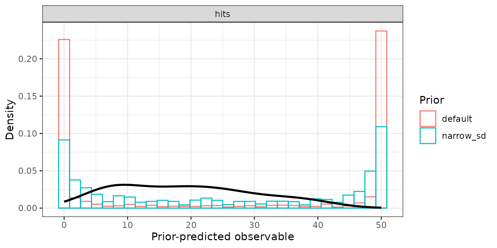
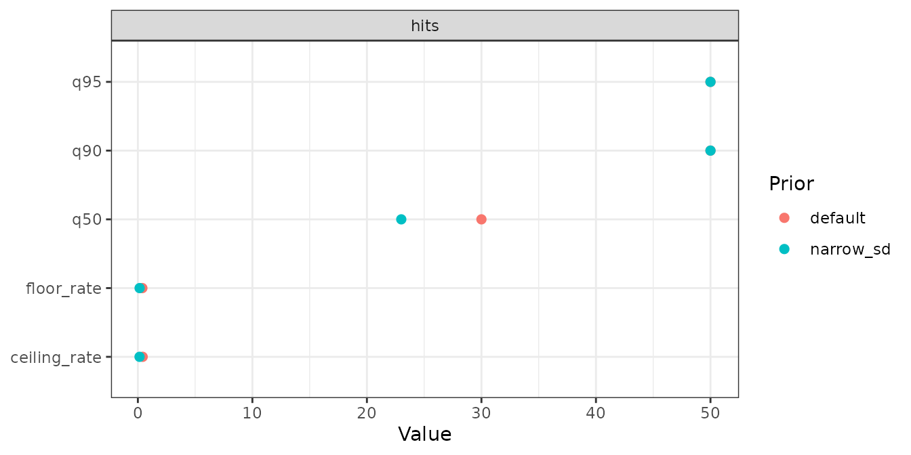
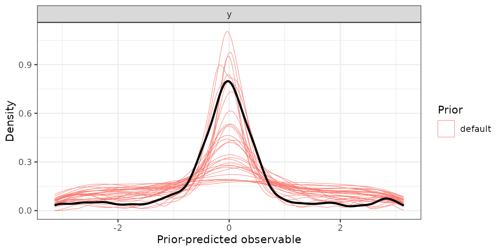

# Prior predictive checks on the observable scale

Priors of cognitive measurement models are set on the link scale, and
what a `normal(0, 1)` there means for the data is rarely obvious.
[`prior_check()`](https://www.gfrischkorn.org/bmmtools/reference/prior_check.md)
answers that directly: it fits the model with `sample_prior = "only"`,
draws from the prior predictive distribution and summarises the draws on
the scale of the response. Because the draws come from bmm’s own fit,
the prior being checked is exactly the prior bmm fits with, defaults
included.

The fits go through
[`fit_cached()`](https://www.gfrischkorn.org/bmmtools/reference/fit_cached.md),
so each prior set compiles and samples once and later calls reuse it.
Two checks are shown below: a signal detection model, whose count
response has a floor and a ceiling, and a mixture model with a statistic
of our own.

## A count response: sdt_yn

The first example is the check behind `prior_check_sdt_yn`, the prior
check that ships with the package. It compares bmm’s default priors with
a set that narrows the priors on the between-subject SDs:

``` r

sdt <- bmm::sdt_yn(response = "hits", stimulus = "stim", n_trials = "n")
sdt_data <- simulate_recovery(
  sdt,
  pars = c(d = 1, criterion = 0.3), sds = c(d = 0.3, criterion = 0.3),
  n_subjects = 20, n_trials = 50, seed = 2026
)$data

narrow_sd <- brms::set_prior("normal(0, 1)", class = "sd", dpar = "d") +
  brms::set_prior("normal(0, 1)", class = "sd", dpar = "criterion")

prior_check_sdt_yn <- prior_check(
  sdt, recovery_formula(sdt), sdt_data,
  prior = list(default = NULL, narrow_sd = narrow_sd),
  n_draws = 100, seed = 2026,
  file = "data-raw/fits/prior-check/sdt_yn",
  chains = 2, iter = 1000, backend = "cmdstanr", refresh = 0, silent = 2
)
```

`prior` is either one prior (or `NULL` for bmm’s defaults) or a **named
list** of prior sets. Each set is fitted separately, its fit cached at
`<file>-<set>`, and becomes one level of the `prior` column.

``` r

prior_check_sdt_yn
#> <bmmtools_prior_check>
#> Model: Signal Detection Theory (Yes/No); 2 prior sets: default, narrow_sd.
#> Prior-predictive draws per set: 100.
#> 
#> # A tibble: 5 × 5
#>   response statistic    default narrow_sd difference
#>   <chr>    <chr>          <dbl>     <dbl>      <dbl>
#> 1 hits     floor_rate     0.392     0.152     -0.241
#> 2 hits     ceiling_rate   0.420     0.146     -0.274
#> 3 hits     q50           30        23         -7    
#> 4 hits     q90           50        50          0    
#> 5 hits     q95           50        50          0
```

The default summary has five statistics per response:

- `floor_rate` and `ceiling_rate`: the share of all prior-predictive
  values, over draws and observations, at or below the floor and at or
  above the ceiling of the response;
- `q50`, `q90` and `q95`: quantiles of the prior-predictive values.

For `sdt_yn` and `sdt_mafc` the floor is 0 and the ceiling is the trial
count of each row, read from the model’s `n_trials` column. With exactly
two prior sets, [`summary()`](https://rdrr.io/r/base/summary.html) adds
a `difference` column, the second set minus the first. Here, 39.2% of
the prior-predictive counts under bmm’s defaults are at 0 and 41.9% at
the ceiling; with the narrower SD priors the shares are 15.2% and 14.6%.

``` r

summary(prior_check_sdt_yn)
#> # A tibble: 5 × 5
#>   response statistic    default narrow_sd difference
#>   <chr>    <chr>          <dbl>     <dbl>      <dbl>
#> 1 hits     floor_rate     0.392     0.152     -0.241
#> 2 hits     ceiling_rate   0.420     0.146     -0.274
#> 3 hits     q50           30        23         -7    
#> 4 hits     q90           50        50          0    
#> 5 hits     q95           50        50          0
```

For a discrete response, plot the draws as histograms:

``` r

plot_prior_check(prior_check_sdt_yn, type = "histogram")
```



`type = "statistic"` plots the summary table instead, one point per
statistic and prior set:

``` r

plot_prior_check(prior_check_sdt_yn, type = "statistic")
```



## A continuous response and a statistic of your own

For a continuous response, a value exactly at a bound has probability
zero, so the two rates are only informative for counts. For the circular
models `mixture2p` and `sdm` the range is set to `-pi` and `pi`, and the
rates report mass outside it. The quantiles of a signed circular error
are symmetric about zero, so a statistic on the absolute error says
more. `summary` takes any function of `yrep`, the matrix of
prior-predictive draws (draws in rows, observations in columns), and
`data`, and returns a data frame with the columns `statistic` and
`value`, plus `response` for a model with several responses:

``` r

mix <- bmm::mixture2p(resp_error = "y")
mix_data <- simulate_recovery(
  mix,
  pars = c(kappa = log(8), thetat = qlogis(0.75)),
  sds = c(kappa = 0.3, thetat = 0.5),
  n_subjects = 10, n_trials = 40, seed = 1
)$data

abs_error <- function(yrep, data) {
  tibble::tibble(
    statistic = c("abs_q50", "abs_q90"),
    value = unname(stats::quantile(abs(yrep), c(0.5, 0.9)))
  )
}
mix_check <- prior_check(
  mix, recovery_formula(mix), mix_data,
  summary = abs_error,
  n_draws = 50, seed = 1,
  file = file.path(fits_dir, "prior-mixture2p"),
  chains = 2, iter = 1000, backend = "cmdstanr"
)
summary(mix_check)
```

    #> # A tibble: 2 × 3
    #>   response statistic default
    #>   <chr>    <chr>       <dbl>
    #> 1 y        abs_q50     0.734
    #> 2 y        abs_q90     2.64

The default plot draws one thin density line per prior-predictive draw,
so the spread between draws stays visible, with the observed response
from `data` on top:

``` r

plot_prior_check(mix_check, draws = 30)
```



`observed = FALSE` removes the overlay. It is left out without comment
when `data` has no response column, for example when the check runs over
a design skeleton rather than simulated or real data.

## Arguments worth knowing

- `range`:

  The floor and the ceiling of the response as two numbers. `NULL`
  derives them for `sdt_yn`, `sdt_mafc`, `mixture2p` and `sdm`; for any
  other model the two rates are `NA` and a message says so.

- `n_draws`: Prior-predictive draws kept per prior set. Asking for more
  than the fit holds is capped with a message rather than refused.

- `seed`: Passed to the fitter, where it enters the cache key, and used
  around the draw subsample, so the same seed keeps the same draws.

- `file`:

  Where the prior-only fits are cached. `NULL` uses a temporary file, so
  the compiled model is reused within the session and nothing is left on
  disk.

- `...`:

  Passed to
  [`fit_cached()`](https://www.gfrischkorn.org/bmmtools/reference/fit_cached.md)
  and on to [`bmm::bmm()`](https://venpopov.com/bmm/reference/bmm.html):
  `chains`, `iter`, `backend`, `cores`. Giving `sample_prior` is an
  error, because the check sets it.

A population-level slope without a proper prior triggers a warning
before fitting, because prior-only sampling has nothing to draw a flat
prior from. bmm’s defaults cover the intercepts and the group-level SDs,
so the warning concerns slopes you added to the formula.

## What the object carries

Besides the summary rows, a `bmmtools_prior_check` keeps the draws, the
[`brms::prior_summary()`](https://mc-stan.org/rstantools/reference/prior_summary.html)
of each fit, the data, the model, the formula and the cache files as
attributes. The prior summary records the prior that produced the draws,
which is the one to report:

``` r

attr(prior_check_sdt_yn, "priors")$narrow_sd
#>            prior     class      coef group resp      dpar nlpar lb ub tag  source
#> 1 normal(0, 1.5) Intercept                      criterion                    user
#> 2   normal(1, 1) Intercept                              d                    user
#> 3    constant(0) Intercept                        sdratio                    user
#> 4   normal(0, 1)        sd                      criterion        0           user
#> 5   normal(0, 1)        sd                              d        0           user
#> 6                       sd              id      criterion                 default
#> 7                       sd Intercept    id      criterion                 default
#> 8                       sd              id              d                 default
#> 9                       sd Intercept    id              d                 default
```
