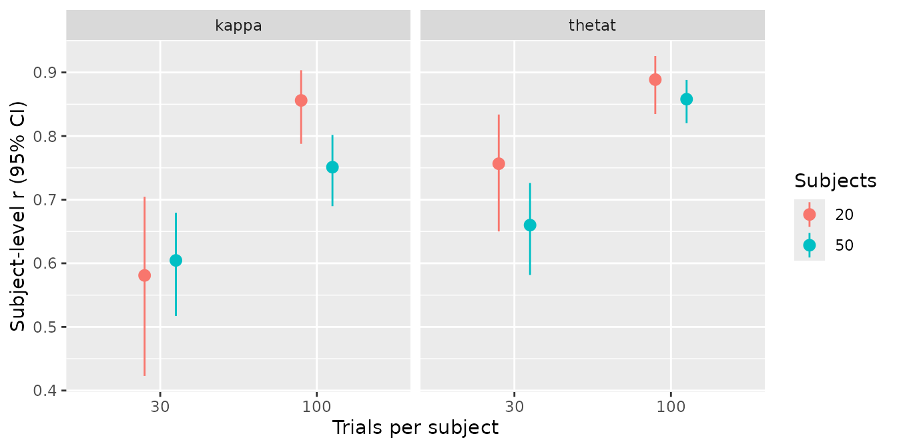
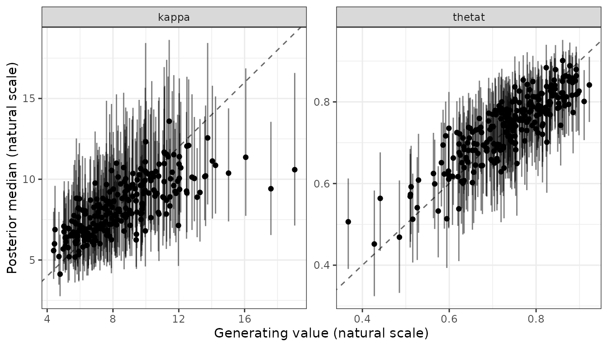

# Running a recovery study

A recovery study repeats the loop of [Validating a new bmm
model](https://www.gfrischkorn.org/bmmtools/articles/bmmtools.md),
simulate, fit and score, over a design: several numbers of subjects and
trials, several replications of each.
[`recovery_grid()`](https://www.gfrischkorn.org/bmmtools/reference/recovery_grid.md)
runs that loop and takes care of what makes long simulations fragile:
every cell is saved as soon as it finishes, an interrupted run resumes
from those files, and a short preflight fit catches a broken model
before hours are spent on it.

The example below is the grid behind `recovery_mixture2p`, the recovery
object that ships with the package. Its results are used live on this
page. The run took 8 minutes 58 seconds, compilation and preflight
included.

## The call

``` r

library(bmmtools)

recovery_mixture2p <- recovery_grid(
  bmm::mixture2p(resp_error = "y"),
  grid = expand.grid(n_subjects = c(20, 50), n_trials = c(30, 100)),
  pars = c(kappa = log(8), thetat = qlogis(0.75)),
  sds = c(kappa = 0.3, thetat = 0.5),
  dir = "data-raw/fits/recovery", reps = 5, seed = 2026,
  chains = 4, iter = 1000, cores = 4, backend = "cmdstanr",
  refresh = 0, silent = 2
)
```

Everything after `seed` is passed to
[`fit_cached()`](https://www.gfrischkorn.org/bmmtools/reference/fit_cached.md)
and from there to
[`bmm::bmm()`](https://venpopov.com/bmm/reference/bmm.html).

## The design grid

`grid` is a data frame with one row per condition. It needs the columns
`n_subjects` and `n_trials`; any other column named after a parameter
sets that parameter’s population value for the row, and a column
`sd_<parameter>` sets its between-subject SD. Both override `pars` and
`sds`, which act as the defaults for every row:

``` r

grid <- expand.grid(
  n_subjects = c(20, 50),
  n_trials = c(30, 100),
  kappa = log(c(4, 16))
)
```

A design created with `SimDesign::createDesign()` is a data frame and
can be passed as it is. `model` can also be a function of one grid row
that returns a model, for designs where the model’s arguments change
between rows; the link table must stay the same across rows, because one
table scores every cell.

## Smoke run and preflight

Before the full grid, run it with `smoke = TRUE`. This fits the first
two rows with two replications into `<dir>/smoke`, so a smoke run never
overwrites or gets mistaken for a full one.

By default, the grid also runs a **preflight**: before any cell, the
first cell is fitted once with one chain and 200 iterations into
`<dir>/preflight`. A compile error, an init failure or data the model
rejects stop the grid there, with nothing else run. The preflight is
skipped when the first cell already has a cached fit.

## Files on disk and resuming

Each cell writes two files as soon as it is done, named after its grid
row and replication:

- `cell-<row>-rep-<rep>-sim.rds` holds the simulated data and truth;
- `cell-<row>-rep-<rep>.rds` holds the fit, with its cache key in
  `cell-<row>-rep-<rep>.key`.

To resume after an interruption, run the same call again. A cell whose
simulation file exists reads it instead of simulating, and a cell whose
fit matches its key reuses the fit, so finished cells cost only the time
to read them. Rerunning the script that builds the example objects, with
all 20 grid fits on disk, took 23 seconds, including two prior-only fits
that were not cached yet. If an argument that enters the key changes,
say `iter`, every affected cell is refitted and the message names the
component that changed.

Cells run in replication-major order: every row of replication 1, then
every row of replication 2, and so on. If a run is stopped early, the
finished cells already span the whole design.

## Seeds and simulated people

`seed` is a master seed. Each cell derives its own seed from it, its row
and its replication, so any single cell can be reproduced without
running the ones before it.

`subjects = "redraw"`, the default, draws new subject values in every
replication. `subjects = "fixed"` draws them once per row, in the first
replication, and reuses them in every later one, so the replications
become repeated simulations of the same people.

## When a cell fails

A cell whose fit throws an error is recorded with `status = "error"`,
the grid goes on, and a warning at the end lists the failed cells with
the first error message. A cell whose data cannot be generated stops the
grid instead, since that is an error in the design rather than in the
sampler.

## Two estimators in one grid

`ml = TRUE` fits every cell a second time subject by subject with no
pooling, on the same simulated data, and scores both estimators against
the same truth at the subject level, so
[`summary()`](https://rdrr.io/r/base/summary.html) returns a row per
estimator. `ml = list(...)` passes arguments to
[`fit_ml()`](https://www.gfrischkorn.org/bmmtools/reference/fit_ml.md),
and `ml = list(method = "optim")` runs the second fit without a
compiler. The per-cell record is `attr(x, "ml_cells")`, and a cell whose
ML fit fails keeps its hierarchical rows. [Hierarchical estimation
against subject-wise maximum
likelihood](https://www.gfrischkorn.org/bmmtools/articles/hierarchical-vs-ml.md)
works through the comparison and what its columns mean.

## The result

The grid returns a single `bmmtools_recovery` object with population and
subject rows for every cell. The `condition` column names the grid row:

``` r

recovery_mixture2p
#> <bmmtools_recovery>
#> Scored on the natural scale.
#> 5 fits, 2 parameters: kappa, thetat.
#> Levels: population, subject.
#> 
#> # A tibble: 16 × 24
#>    condition term   estimator level      scale       n n_replications n_converged
#>    <chr>     <chr>  <chr>     <chr>      <chr>   <dbl>          <int>       <int>
#>  1 row-1     kappa  bayes     population natural     5              5           3
#>  2 row-1     thetat bayes     population natural     5              5           3
#>  3 row-2     kappa  bayes     population natural     5              5           4
#>  4 row-2     thetat bayes     population natural     5              5           4
#>  5 row-3     kappa  bayes     population natural     5              5           5
#>  6 row-3     thetat bayes     population natural     5              5           5
#>  7 row-4     kappa  bayes     population natural     5              5           3
#>  8 row-4     thetat bayes     population natural     5              5           3
#>  9 row-1     kappa  bayes     subject    natural    20              5           3
#> 10 row-1     thetat bayes     subject    natural    20              5           3
#> 11 row-2     kappa  bayes     subject    natural    50              5           4
#> 12 row-2     thetat bayes     subject    natural    50              5           4
#> 13 row-3     kappa  bayes     subject    natural    20              5           5
#> 14 row-3     thetat bayes     subject    natural    20              5           5
#> 15 row-4     kappa  bayes     subject    natural    50              5           3
#> 16 row-4     thetat bayes     subject    natural    50              5           3
#>         bias    rmse coverage ci_width      r  r_low r_high rank_r     ccc ccc_low
#>        <dbl>   <dbl>    <dbl>    <dbl>  <dbl>  <dbl>  <dbl>  <dbl>   <dbl>   <dbl>
#>  1  0.427    1.45       0.8     3.58   NA     NA     NA     NA     NA      NA     
#>  2  0.0349   0.0678     0.8     0.151  NA     NA     NA     NA     NA      NA     
#>  3  0.656    0.671      1       2.45   NA     NA     NA     NA     NA      NA     
#>  4 -0.000662 0.00505    1       0.0850 NA     NA     NA     NA     NA      NA     
#>  5  0.125    0.512      1       2.93   NA     NA     NA     NA     NA      NA     
#>  6 -0.00646  0.0240     1       0.112  NA     NA     NA     NA     NA      NA     
#>  7  0.121    0.225      1       1.63   NA     NA     NA     NA     NA      NA     
#>  8 -0.00299  0.00909    1       0.0645 NA     NA     NA     NA     NA      NA     
#>  9 -0.275    2.38       0.87    7.93    0.581  0.423  0.705  0.538  0.0508  0.0148
#> 10  0.0210   0.0869     0.92    0.292   0.757  0.650  0.834  0.671  0.587   0.483 
#> 11  0.0974   2.39       0.924   8.49    0.605  0.517  0.679  0.615  0.255   0.207 
#> 12  0.00457  0.0712     0.92    0.272   0.660  0.582  0.726  0.617  0.453   0.379 
#> 13 -0.144    1.58       0.96    6.25    0.856  0.788  0.903  0.819  0.799   0.731 
#> 14  0.00453  0.0500     0.97    0.197   0.889  0.835  0.926  0.830  0.854   0.796 
#> 15 -0.259    1.69       0.932   5.76    0.751  0.690  0.802  0.776  0.676   0.615 
#> 16  0.00164  0.0502     0.948   0.189   0.858  0.820  0.888  0.825  0.825   0.786 
#>    ccc_high ccc_accuracy ccc_scale_shift ccc_location_shift calibration_slope truth_sd
#>       <dbl>        <dbl>           <dbl>              <dbl>             <dbl>    <dbl>
#>  1  NA            NA              NA                NA                 NA       0     
#>  2  NA            NA              NA                NA                 NA       0     
#>  3  NA            NA              NA                NA                 NA       0     
#>  4  NA            NA              NA                NA                 NA       0     
#>  5  NA            NA              NA                NA                 NA       0     
#>  6  NA            NA              NA                NA                 NA       0     
#>  7  NA            NA              NA                NA                 NA       0     
#>  8  NA            NA              NA                NA                 NA       0     
#>  9   0.0867        0.474           0.261            -0.689              1.77    2.44  
#> 10   0.676         0.813           0.880             0.207              0.825   0.0942
#> 11   0.302         0.652           0.375             0.0871             1.59    2.80  
#> 12   0.521         0.866           0.649             0.0546             0.982   0.0917
#> 13   0.852         0.944           0.763            -0.0450             1.11    2.87  
#> 14   0.897         0.962           0.840             0.0450             1.05    0.0990
#> 15   0.730         0.904           0.669            -0.126              1.11    2.45  
#> 16   0.858         0.965           0.814             0.0206             1.05    0.0956
#> 
#> r, rank_r and ccc are NA where they are not estimable: they need at least 3 complete pairs and spread on both sides.
```

[`summary()`](https://rdrr.io/r/base/summary.html) groups by condition.
Population-level correlations are `NA` here because every replication of
a row uses the same population values, so the truth has no spread within
a condition; bias, RMSE and coverage are still defined.

The attribute `cells` has one row per cell, with its seed, file, status,
runtime in seconds and convergence verdict:

``` r

cells <- attr(recovery_mixture2p, "cells")
cells
#> # A tibble: 20 × 9
#>    condition replication n_subjects n_trials  seed file           status elapsed converged
#>    <chr>           <int>      <int>    <int> <dbl> <chr>          <chr>    <dbl> <lgl>    
#>  1 row-1               1         20       30  9946 data-raw/fits… ok       0.630 TRUE     
#>  2 row-2               1         50       30 17865 data-raw/fits… ok       0.656 TRUE     
#>  3 row-3               1         20      100 25784 data-raw/fits… ok       0.229 TRUE     
#>  4 row-4               1         50      100 33703 data-raw/fits… ok       0.595 TRUE     
#>  5 row-1               2         20       30  9947 data-raw/fits… ok       0.240 FALSE    
#>  6 row-2               2         50       30 17866 data-raw/fits… ok       0.682 TRUE     
#>  7 row-3               2         20      100 25785 data-raw/fits… ok       0.235 TRUE     
#>  8 row-4               2         50      100 33704 data-raw/fits… ok       0.502 TRUE     
#>  9 row-1               3         20       30  9948 data-raw/fits… ok       0.230 TRUE     
#> 10 row-2               3         50       30 17867 data-raw/fits… ok       0.501 FALSE    
#> 11 row-3               3         20      100 25786 data-raw/fits… ok       0.232 TRUE     
#> 12 row-4               3         50      100 33705 data-raw/fits… ok       0.679 FALSE    
#> 13 row-1               4         20       30  9949 data-raw/fits… ok       0.232 FALSE    
#> 14 row-2               4         50       30 17868 data-raw/fits… ok       0.499 TRUE     
#> 15 row-3               4         20      100 25787 data-raw/fits… ok       0.314 TRUE     
#> 16 row-4               4         50      100 33706 data-raw/fits… ok       0.494 FALSE    
#> 17 row-1               5         20       30  9950 data-raw/fits… ok       0.231 TRUE     
#> 18 row-2               5         50       30 17869 data-raw/fits… ok       0.601 TRUE     
#> 19 row-3               5         20      100 25788 data-raw/fits… ok       0.233 TRUE     
#> 20 row-4               5         50      100 33707 data-raw/fits… ok       0.600 TRUE
```

To read the summary against the design, join the design columns from
`cells`:

``` r

design <- unique(cells[c("condition", "n_subjects", "n_trials")])

subject_summary <- summary(recovery_mixture2p) |>
  dplyr::filter(level == "subject") |>
  dplyr::left_join(design, by = "condition")

subject_summary[c(
  "term", "n_subjects", "n_trials", "n_converged",
  "bias", "rmse", "coverage", "r", "r_low", "r_high"
)]
#> # A tibble: 8 × 10
#>   term   n_subjects n_trials n_converged     bias   rmse coverage     r r_low r_high
#>   <chr>       <int>    <int>       <int>    <dbl>  <dbl>    <dbl> <dbl> <dbl>  <dbl>
#> 1 kappa          20       30           3 -0.275   2.38      0.87  0.581 0.423  0.705
#> 2 thetat         20       30           3  0.0210  0.0869    0.92  0.757 0.650  0.834
#> 3 kappa          50       30           4  0.0974  2.39      0.924 0.605 0.517  0.679
#> 4 thetat         50       30           4  0.00457 0.0712    0.92  0.660 0.582  0.726
#> 5 kappa          20      100           5 -0.144   1.58      0.96  0.856 0.788  0.903
#> 6 thetat         20      100           5  0.00453 0.0500    0.97  0.889 0.835  0.926
#> 7 kappa          50      100           3 -0.259   1.69      0.932 0.751 0.690  0.802
#> 8 thetat         50      100           3  0.00164 0.0502    0.948 0.858 0.820  0.888
```

``` r

library(ggplot2)
ggplot(
  subject_summary,
  aes(factor(n_trials), r,
    ymin = r_low, ymax = r_high,
    colour = factor(n_subjects)
  )
) +
  geom_pointrange(position = position_dodge(width = 0.4)) +
  facet_wrap(~term) +
  labs(
    x = "Trials per subject", y = "Subject-level r (95% CI)",
    colour = "Subjects"
  )
```



Because the object keeps its class through dplyr verbs, a single cell
can be plotted directly:

``` r

recovery_mixture2p |>
  dplyr::filter(condition == "row-4", level == "subject") |>
  plot_recovery()
```



`elapsed` is the time a cell took in the run that returned the object,
in seconds, so the fitting time of the grid in minutes is:

``` r

sum(cells$elapsed) / 60
#> [1] 0.1435761
```

After a resume, a cell whose fit was read from disk records the time it
took to read it, not the time it once took to fit.
