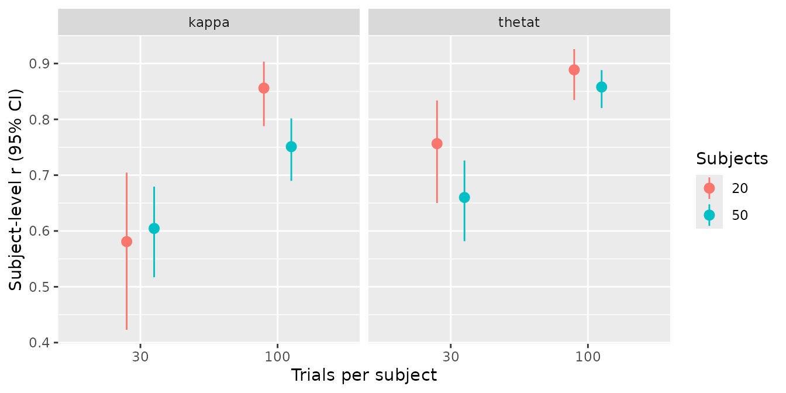
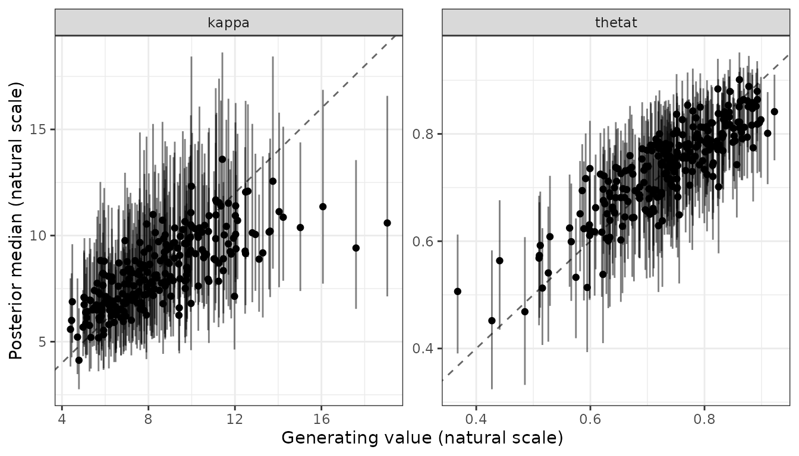

# Running a recovery study

A recovery study repeats the loop of [Validating a new bmm
model](https://www.gfrischkorn.org/bmmtools/articles/bmmtools.md),
simulate, fit and score, over a design: several numbers of subjects and
trials, several replications of each.
[`recovery_grid()`](https://www.gfrischkorn.org/bmmtools/reference/recovery_grid.md)
runs that loop and takes care of what makes long simulations fragile:
every cell is saved as soon as it finishes, an interrupted run resumes
from those files, and a short preflight fit catches a broken model
before hours are spent on it.

The example below is the grid behind `recovery_mixture2p`, the recovery
object that ships with the package. Its results are used live on this
page. The run took 8 minutes 58 seconds, compilation and preflight
included.

## The call

``` r

library(bmmtools)

recovery_mixture2p <- recovery_grid(
  bmm::mixture2p(resp_error = "y"),
  grid = expand.grid(n_subjects = c(20, 50), n_trials = c(30, 100)),
  pars = c(kappa = log(8), thetat = qlogis(0.75)),
  sds = c(kappa = 0.3, thetat = 0.5),
  dir = "data-raw/fits/recovery", reps = 5, seed = 2026,
  chains = 4, iter = 1000, cores = 4, backend = "cmdstanr",
  refresh = 0, silent = 2
)
```

Everything after `seed` is passed to
[`fit_cached()`](https://www.gfrischkorn.org/bmmtools/reference/fit_cached.md)
and from there to
[`bmm::bmm()`](https://venpopov.com/bmm/reference/bmm.html).

The call names `backend = "cmdstanr"`, and a grid should run on it.
cmdstanr compiles the model once and every cell with the same Stan code
reuses the executable, while rstan compiles again for every fit: in a
measurement on a small `mixture2p` grid, compiling took 21 to 23 seconds
per fit under rstan, 77 to 85 % of a cell’s time, and once about 6
seconds under cmdstanr. Without a `backend` or the `brms.backend`
option, bmm picks cmdstanr when it is installed. A grid resumed in a new
R session compiles once more, because cmdstanr keeps executables in a
temporary directory; setting `options(cmdstanr_write_stan_file_dir = )`
to a directory that persists avoids that (see “Backend” in
[`?recovery_grid`](https://www.gfrischkorn.org/bmmtools/reference/recovery_grid.md)).

## The design grid

`grid` is a data frame with one row per condition. It needs the columns
`n_subjects` and `n_trials`; any other column named after a parameter
sets that parameter’s population value for the row, and a column
`sd_<parameter>` sets its between-subject SD. Both override `pars` and
`sds`, which act as the defaults for every row:

``` r

grid <- expand.grid(
  n_subjects = c(20, 50),
  n_trials = c(30, 100),
  kappa = log(c(4, 16))
)
```

A design created with `SimDesign::createDesign()` is a data frame and
can be passed as it is. `model` can also be a function of one grid row
that returns a model, for designs where the model’s arguments change
between rows; the link table must stay the same across rows, because one
table scores every cell.

## Smoke run and preflight

Before the full grid, run it with `smoke = TRUE`. This fits the first
two rows with two replications into `<dir>/smoke`, so a smoke run never
overwrites or gets mistaken for a full one.

By default, the grid also runs a **preflight**: before any cell, the
first cell is fitted once with one chain and 200 iterations into
`<dir>/preflight`. A compile error, an init failure or data the model
rejects stop the grid there, with nothing else run. The preflight is
skipped when the first cell already has a cached fit.

## Files on disk and resuming

Each cell writes two files as soon as it is done, named after its grid
row and replication:

- `cell-<row>-rep-<rep>-sim.rds` holds the simulated data and truth;
- `cell-<row>-rep-<rep>.rds` holds the fit, with its cache key in
  `cell-<row>-rep-<rep>.key`.

To resume after an interruption, run the same call again. A cell whose
simulation file exists reads it instead of simulating, and a cell whose
fit matches its key reuses the fit, so finished cells cost only the time
to read them. Rerunning the script that builds the example objects, with
all 20 grid fits on disk, took 23 seconds, including two prior-only fits
that were not cached yet. If an argument that enters the key changes,
say `iter`, every affected cell is refitted and the message names the
component that changed.

Cells run in replication-major order: every row of replication 1, then
every row of replication 2, and so on. If a run is stopped early, the
finished cells already span the whole design.

## Seeds and simulated people

`seed` is a master seed. Each cell derives its own seed from it, its row
and its replication, so any single cell can be reproduced without
running the ones before it.

`subjects = "redraw"`, the default, draws new subject values in every
replication. `subjects = "fixed"` draws them once per row, in the first
replication, and reuses them in every later one, so the replications
become repeated simulations of the same people.

## When a cell fails

A cell whose fit throws an error is recorded with `status = "error"`,
the grid goes on, and a warning at the end lists the failed cells with
the first error message. A cell whose data cannot be generated stops the
grid instead, since that is an error in the design rather than in the
sampler.

## Two estimators in one grid

`ml = TRUE` fits every cell a second time subject by subject with no
pooling, on the same simulated data, and scores both estimators against
the same truth at the subject level, so
[`summary()`](https://rdrr.io/r/base/summary.html) returns a row per
estimator. `ml = list(...)` passes arguments to
[`fit_ml()`](https://www.gfrischkorn.org/bmmtools/reference/fit_ml.md),
and `ml = list(method = "optim")` runs the second fit without a
compiler. The per-cell record is `attr(x, "ml_cells")`, and a cell whose
ML fit fails keeps its hierarchical rows. [Hierarchical estimation
against subject-wise maximum
likelihood](https://www.gfrischkorn.org/bmmtools/articles/hierarchical-vs-ml.md)
works through the comparison and what its columns mean.

## The result

The grid returns a single `bmmtools_recovery` object with population and
subject rows for every cell. The `condition` column names the grid row:

``` r

recovery_mixture2p
#> <bmmtools_recovery>
#> Scored on the natural scale.
#> 5 fits, 2 parameters: kappa, thetat.
#> Levels: population, subject.
#> 
#> # A tibble: 16 × 16
#>    condition term   level      scale       n      bias    rmse coverage coverage_50
#>    <chr>     <chr>  <chr>      <chr>   <dbl>     <dbl>   <dbl>    <dbl>       <dbl>
#>  1 row-1     kappa  population natural     5  0.427    1.45       0.8         0.2  
#>  2 row-1     thetat population natural     5  0.0349   0.0678     0.8         0    
#>  3 row-2     kappa  population natural     5  0.656    0.671      1           0.2  
#>  4 row-2     thetat population natural     5 -0.000662 0.00505    1           1    
#>  5 row-3     kappa  population natural     5  0.125    0.512      1           0.6  
#>  6 row-3     thetat population natural     5 -0.00646  0.0240     1           0.6  
#>  7 row-4     kappa  population natural     5  0.121    0.225      1           0.8  
#>  8 row-4     thetat population natural     5 -0.00299  0.00909    1           0.8  
#>  9 row-1     kappa  subject    natural    20 -0.275    2.38       0.87        0.37 
#> 10 row-1     thetat subject    natural    20  0.0210   0.0869     0.92        0.45 
#> 11 row-2     kappa  subject    natural    50  0.0974   2.39       0.924       0.396
#> 12 row-2     thetat subject    natural    50  0.00457  0.0712     0.92        0.48 
#> 13 row-3     kappa  subject    natural    20 -0.144    1.58       0.96        0.52 
#> 14 row-3     thetat subject    natural    20  0.00453  0.0500     0.97        0.52 
#> 15 row-4     kappa  subject    natural    50 -0.259    1.69       0.932       0.5  
#> 16 row-4     thetat subject    natural    50  0.00164  0.0502     0.948       0.476
#>      z_mean  z_sd contraction      r     ccc calibration_slope calibration_intercept
#>       <dbl> <dbl>       <dbl>  <dbl>   <dbl>             <dbl>                 <dbl>
#>  1  0.217   1.73           NA NA     NA                 NA                   NA     
#>  2  0.655   1.52           NA NA     NA                 NA                   NA     
#>  3  1.10    0.290          NA NA     NA                 NA                   NA     
#>  4 -0.0321  0.284          NA NA     NA                 NA                   NA     
#>  5  0.246   0.714          NA NA     NA                 NA                   NA     
#>  6 -0.213   1.01           NA NA     NA                 NA                   NA     
#>  7  0.283   0.509          NA NA     NA                 NA                   NA     
#>  8 -0.157   0.603          NA NA     NA                 NA                   NA     
#>  9 -0.168   1.31           NA  0.581  0.0508             1.77                -6.84  
#> 10  0.246   1.00           NA  0.757  0.587              0.825                0.0675
#> 11  0.214   1.19           NA  0.605  0.255              1.59                -8.26  
#> 12  0.00563 1.06           NA  0.660  0.453              0.982               -0.0393
#> 13 -0.0107  1.01           NA  0.856  0.799              1.11                -1.08  
#> 14  0.0416  1.00           NA  0.889  0.854              1.05                -0.0501
#> 15 -0.0448  1.05           NA  0.751  0.676              1.11                -0.699 
#> 16 -0.0250  1.07           NA  0.858  0.825              1.05                -0.0443
#> # 19 more columns; `tibble::as_tibble()` prints them all.
#> 
#> r, rank_r and ccc are NA where they are not estimable: they need at least 3 complete pairs and spread on both sides.
```

[`summary()`](https://rdrr.io/r/base/summary.html) groups by condition.
Population-level correlations are `NA` here because every replication of
a row uses the same population values, so the truth has no spread within
a condition; bias, RMSE and coverage are still defined.

The attribute `cells` has one row per cell, with its seed, file, status,
runtime in seconds and convergence verdict:

``` r

cells <- attr(recovery_mixture2p, "cells")
cells
#> # A tibble: 20 × 20
#>    condition replication n_subjects n_trials  seed file  status elapsed converged max_rhat
#>    <chr>           <int>      <int>    <int> <dbl> <chr> <chr>    <dbl> <lgl>        <dbl>
#>  1 row-1               1         20       30  9946 data… ok     0.00263 TRUE          1.01
#>  2 row-2               1         50       30 17865 data… ok     0.0158  TRUE          1.01
#>  3 row-3               1         20      100 25784 data… ok     0.00222 TRUE          1.01
#>  4 row-4               1         50      100 33703 data… ok     0.00248 TRUE          1.01
#>  5 row-1               2         20       30  9947 data… ok     0.00243 FALSE         1.01
#>  6 row-2               2         50       30 17866 data… ok     0.00284 TRUE          1.01
#>  7 row-3               2         20      100 25785 data… ok     0.00207 TRUE          1.01
#>  8 row-4               2         50      100 33704 data… ok     0.00237 TRUE          1.01
#>  9 row-1               3         20       30  9948 data… ok     0.00208 TRUE          1.01
#> 10 row-2               3         50       30 17867 data… ok     0.00226 FALSE         1.01
#> 11 row-3               3         20      100 25786 data… ok     0.00200 TRUE          1.01
#> 12 row-4               3         50      100 33705 data… ok     0.00218 FALSE         1.02
#> 13 row-1               4         20       30  9949 data… ok     0.00204 FALSE         1.01
#> 14 row-2               4         50       30 17868 data… ok     0.00212 TRUE          1.01
#> 15 row-3               4         20      100 25787 data… ok     0.00214 TRUE          1.01
#> 16 row-4               4         50      100 33706 data… ok     0.00206 FALSE         1.01
#> 17 row-1               5         20       30  9950 data… ok     0.00193 TRUE          1.01
#> 18 row-2               5         50       30 17869 data… ok     0.00213 TRUE          1.01
#> 19 row-3               5         20      100 25788 data… ok     0.00212 TRUE          1.01
#> 20 row-4               5         50      100 33707 data… ok     0.00213 TRUE          1.01
#> # ℹ 10 more variables: min_ess_bulk <dbl>, min_ess_tail <dbl>, n_divergent <int>,
#> #   n_max_treedepth <int>, n_variables <int>, failed <chr>, fit_seconds <dbl>,
#> #   chains <int>, iter <int>, threads <int>
```

To read the summary against the design, join the design columns from
`cells`:

``` r

design <- unique(cells[c("condition", "n_subjects", "n_trials")])

subject_summary <- summary(recovery_mixture2p) |>
  dplyr::filter(level == "subject") |>
  dplyr::left_join(design, by = "condition")

subject_summary[c(
  "term", "n_subjects", "n_trials", "n_converged",
  "bias", "rmse", "coverage", "r", "r_low", "r_high"
)]
#> # A tibble: 8 × 5
#>   term       bias   rmse coverage     r
#>   <chr>     <dbl>  <dbl>    <dbl> <dbl>
#> 1 kappa  -0.275   2.38      0.87  0.581
#> 2 thetat  0.0210  0.0869    0.92  0.757
#> 3 kappa   0.0974  2.39      0.924 0.605
#> 4 thetat  0.00457 0.0712    0.92  0.660
#> 5 kappa  -0.144   1.58      0.96  0.856
#> 6 thetat  0.00453 0.0500    0.97  0.889
#> 7 kappa  -0.259   1.69      0.932 0.751
#> 8 thetat  0.00164 0.0502    0.948 0.858
#> # 5 more columns; `tibble::as_tibble()` prints them all.
```

``` r

library(ggplot2)
ggplot(
  subject_summary,
  aes(factor(n_trials), r,
    ymin = r_low, ymax = r_high,
    colour = factor(n_subjects)
  )
) +
  geom_pointrange(position = position_dodge(width = 0.4)) +
  facet_wrap(~term) +
  labs(
    x = "Trials per subject", y = "Subject-level r (95% CI)",
    colour = "Subjects"
  )
```



Because the object keeps its class through dplyr verbs, a single cell
can be plotted directly:

``` r

recovery_mixture2p |>
  dplyr::filter(condition == "row-4", level == "subject") |>
  plot_recovery()
```



`elapsed` is the time a cell took in the run that returned the object,
in seconds, so the fitting time of the grid in minutes is:

``` r

sum(cells$elapsed) / 60
#> [1] 0.000967296
```

After a resume, a cell whose fit was read from disk records the time it
took to read it, not the time it once took to fit.

## One grid, every estimand

A study usually needs more than one kind of number from the same data:
the population value of each parameter, an experimental effect, how much
people differ, whether those differences go together, and each person’s
own values.
[`recovery_grid()`](https://www.gfrischkorn.org/bmmtools/reference/recovery_grid.md)
scores all of them from one fit per cell. The result is then split back
into one table per estimand family, because a summary that pools subject
values with population effects answers no single question.

The example is `mixture2p` with two tasks. The second task lowers both
precision and the probability of recall. People vary around the task
values, and a person who is precise in one task tends to be precise in
the other:

``` r

library(bmmtools)

model <- bmm::mixture2p(resp_error = "y")
tasks <- c("1", "2")
# cell values on the link scale: task 2 lowers precision and memory
pars <- c(
  kappa_task1 = log(8), kappa_task2 = log(4),
  thetat_task1 = qlogis(0.8), thetat_task2 = qlogis(0.6)
)
sds <- c(
  kappa_task1 = 0.3, kappa_task2 = 0.3,
  thetat_task1 = 0.5, thetat_task2 = 0.5
)
# a person precise in one task is precise in the other
cors <- diag(4)
dimnames(cors) <- rep(list(names(pars)), 2)
cors["kappa_task1", "kappa_task2"] <- 0.7
cors["kappa_task2", "kappa_task1"] <- 0.7
cors["thetat_task1", "thetat_task2"] <- 0.7
cors["thetat_task2", "thetat_task1"] <- 0.7
```

`coding = "contrast"` fits an intercept and a task effect for each
parameter instead of one value per task, and `re_cor = "all"` lets every
subject deviation correlate with every other. Asking for the `"effect"`
and `"sd"` levels and for `correlations` adds those families to the
population and subject rows. Two cells, 40 and 100 subjects with 100
trials per task, ten replications each:

``` r

out <- recovery_grid(
  model,
  grid = data.frame(n_subjects = c(40, 100), n_trials = 100),
  pars = pars,
  dir = file.path(fits_dir, "recovery-grid-combined"),
  reps = 10,
  sds = sds, cors = cors, tasks = tasks,
  coding = "contrast", re_cor = "all",
  levels = c("population", "effect", "sd", "subject"),
  correlations = "model",
  seed = 2028,
  chains = 4, iter = 4000, warmup = 1000, cores = 4,
  threads = brms::threading(3),
  backend = "cmdstanr", refresh = 0, silent = 2
)
```

The data are generated per task. What the fit estimates is the intercept
(task 1, under the default treatment contrasts) and the difference to
task 2, so the grid transforms the generating values into the truth for
each of those terms. The two correlations of .7 between tasks become a
true SD of the `kappa` effect of 0.232 and a true correlation of -0.387
between a person’s `kappa` intercept and their `kappa` effect; the
correlations across parameters are 0.

**Convergence.** The fits ran with bmm 1.3.2.9000, brms 2.23.0 and
CmdStan 2.40.0, 4 chains of 4000 iterations with 1000 of them warmup,
and took 191 minutes of sampling. All 20 of 20 cells converged: the
largest Rhat of any fit was 1.007, the smallest bulk ESS 432 and the
smallest tail ESS 643. One fit had 1 divergent transition out of 12000.
An earlier run with 1000 iterations missed the convergence rule in most
cells; in its worst fit the slowest variables were the correlations of
the task effects, the terms a design like this is least informative
about.

### The families

[`summary()`](https://rdrr.io/r/base/summary.html) of the whole result
has one row per cell, level and term. Splitting it by `level` gives one
table per family:

``` r

families <- split(summary(out), ~level)
names(families)
correlations <- summary(attr(out, "correlations"))
```

``` r

names(families)
#> [1] "effect"     "population" "sd"         "subject"
```

Ten replications per cell set how finely the numbers below can be read:
a coverage over ten intervals moves in steps of .1, so .9 and 1 are both
consistent with a nominal 95 % interval, and a calibration slope from
ten replications shows a direction rather than a size (see [Hierarchical
estimation against subject-wise maximum
likelihood](https://www.gfrischkorn.org/bmmtools/articles/hierarchical-vs-ml.md)).

**Effects** are scored on the link scale, the scale the contrast is
estimated on:

``` r

tibble::as_tibble(families$effect[c(
  "condition", "term", "bias", "rmse", "coverage", "coverage_50",
  "ci_width", "sign_recovery"
)])
#> # A tibble: 4 × 8
#>   condition term             bias   rmse coverage coverage_50 ci_width sign_recovery
#>   <chr>     <chr>           <dbl>  <dbl>    <dbl>       <dbl>    <dbl>         <dbl>
#> 1 row-1     kappa_task1   0.0163  0.0494        1         0.7    0.305             1
#> 2 row-1     thetat_task1  0.0338  0.0796        1         0.7    0.396             1
#> 3 row-2     kappa_task1  -0.00356 0.0333        1         0.7    0.180             1
#> 4 row-2     thetat_task1  0.0226  0.0449        1         0.7    0.256             1
```

The sign of both effects was recovered in every replication. The 95 %
intervals of the `kappa` effect narrow from 0.31 with 40 subjects to
0.18 with 100.

**Population values** are the intercepts, on the natural scale. Every
replication of a cell shares them, so there is no spread in the truth
and the correlation columns are `NA`, as in the grid above:

``` r

tibble::as_tibble(families$population[c(
  "condition", "term", "bias", "rmse", "coverage", "coverage_50"
)])
#> # A tibble: 4 × 6
#>   condition term       bias    rmse coverage coverage_50
#>   <chr>     <chr>     <dbl>   <dbl>    <dbl>       <dbl>
#> 1 row-1     kappa  -0.0509  0.608        0.9         0.1
#> 2 row-1     thetat -0.0119  0.0198       0.8         0.3
#> 3 row-2     kappa   0.00481 0.344        1           0.2
#> 4 row-2     thetat -0.00235 0.00658      1           0.8
```

**Between-subject SDs**, on the link scale:

``` r

tibble::as_tibble(families$sd[c(
  "condition", "term", "bias", "rmse", "coverage", "coverage_50",
  "ci_width"
)])
#> # A tibble: 8 × 7
#>   condition term             bias   rmse coverage coverage_50 ci_width
#>   <chr>     <chr>           <dbl>  <dbl>    <dbl>       <dbl>    <dbl>
#> 1 row-1     kappa        -0.0131  0.0728      0.9         0.5    0.205
#> 2 row-1     kappa_task1  -0.00181 0.111       0.9         0.4    0.370
#> 3 row-1     thetat       -0.0685  0.152       0.8         0.3    0.329
#> 4 row-1     thetat_task1 -0.0413  0.125       1           0.5    0.486
#> 5 row-2     kappa        -0.00410 0.0322      1           0.3    0.123
#> 6 row-2     kappa_task1  -0.0342  0.0799      0.9         0.3    0.261
#> 7 row-2     thetat        0.00103 0.0456      1           0.5    0.210
#> 8 row-2     thetat_task1 -0.00442 0.0715      0.9         0.6    0.309
```

**Subject values** are summarised within each replication and then
combined, so here `r`, `ccc` and the calibration line are defined:

``` r

tibble::as_tibble(families$subject[c(
  "condition", "term", "rmse", "coverage", "r", "calibration_slope",
  "calibration_intercept"
)])
#> # A tibble: 8 × 7
#>   condition term           rmse coverage     r calibration_slope calibration_intercept
#>   <chr>     <chr>         <dbl>    <dbl> <dbl>             <dbl>                 <dbl>
#> 1 row-1     kappa        1.43      0.942 0.833              1.11               -0.963 
#> 2 row-1     kappa_task1  0.112     0.932 0.555              1.45               -0.428 
#> 3 row-1     thetat       0.0468    0.892 0.822              1.24               -0.341 
#> 4 row-1     thetat_task1 0.0651    0.915 0.625              1.40               -0.191 
#> 5 row-2     kappa        1.46      0.94  0.826              1.00                0.0269
#> 6 row-2     kappa_task1  0.108     0.895 0.475              1.37               -0.262 
#> 7 row-2     thetat       0.0421    0.942 0.861              1.01               -0.0152
#> 8 row-2     thetat_task1 0.0620    0.937 0.628              1.05               -0.0210
```

People are ordered better on their task-1 values than on how much they
change between tasks: with 100 subjects, `r` is 0.83 for the `kappa`
intercept and 0.47 for the `kappa` effect, whose true SD is smaller. The
calibration slope of the `kappa` effect is above 1 in both cells (1.45
and 1.37), so its subject estimates are shrunk more than the data
warrant. With ten replications that is the direction, not its size.

**Correlations** come as their own recovery object,
`attr(out, "correlations")`, with its own summary:

``` r

tibble::as_tibble(combined$correlations[c(
  "condition", "term", "true_value", "mean_estimate", "bias",
  "coverage"
)])
#> # A tibble: 12 × 6
#>    condition term                      true_value mean_estimate     bias coverage
#>    <chr>     <chr>                          <dbl>         <dbl>    <dbl>    <dbl>
#>  1 row-1     kappa__kappa_task1            -0.387      -0.153    0.234        0.9
#>  2 row-1     kappa__thetat                  0           0.0367   0.0367       1  
#>  3 row-1     kappa__thetat_task1            0          -0.0256  -0.0256       1  
#>  4 row-1     kappa_task1__thetat            0          -0.0568  -0.0568       1  
#>  5 row-1     kappa_task1__thetat_task1      0          -0.0605  -0.0605       1  
#>  6 row-1     thetat__thetat_task1          -0.387      -0.199    0.188        1  
#>  7 row-2     kappa__kappa_task1            -0.387      -0.214    0.173        0.9
#>  8 row-2     kappa__thetat                  0           0.00538  0.00538      0.9
#>  9 row-2     kappa__thetat_task1            0           0.00828  0.00828      1  
#> 10 row-2     kappa_task1__thetat            0           0.0283   0.0283       1  
#> 11 row-2     kappa_task1__thetat_task1      0          -0.0848  -0.0848       1  
#> 12 row-2     thetat__thetat_task1          -0.387      -0.313    0.0742       0.9
```

The correlations that are 0 in the truth stay near 0. The one between a
person’s `kappa` intercept and `kappa` effect, truly -0.39, is estimated
at -0.15 on average with 40 subjects and -0.21 with 100: pulled towards
0, less so with more people. [Recovering between-subject
correlations](https://www.gfrischkorn.org/bmmtools/articles/correlation-recovery.md)
looks at that attenuation in detail.
